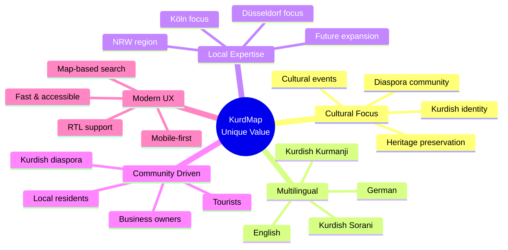
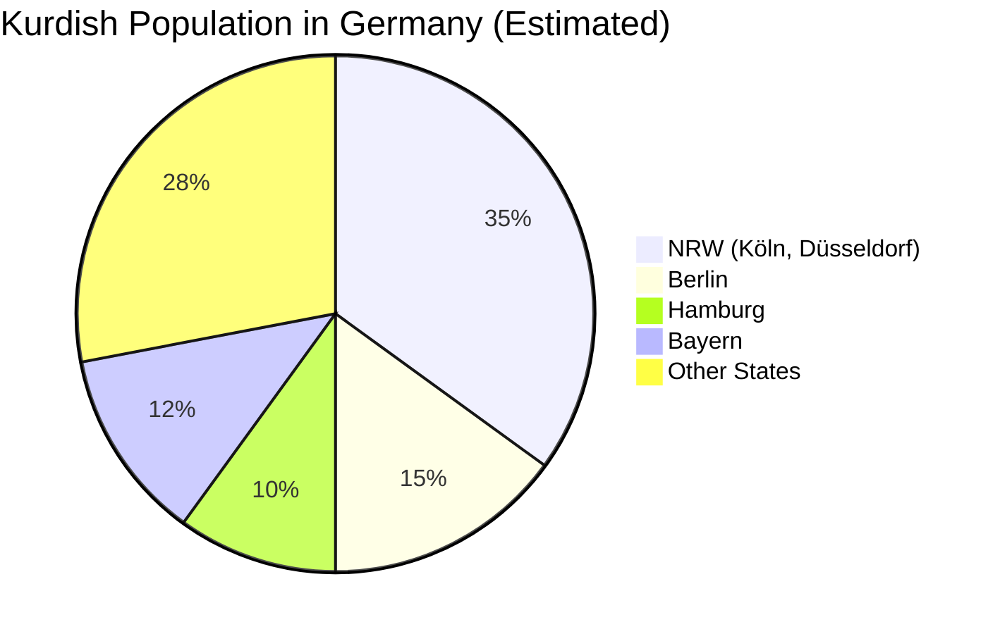
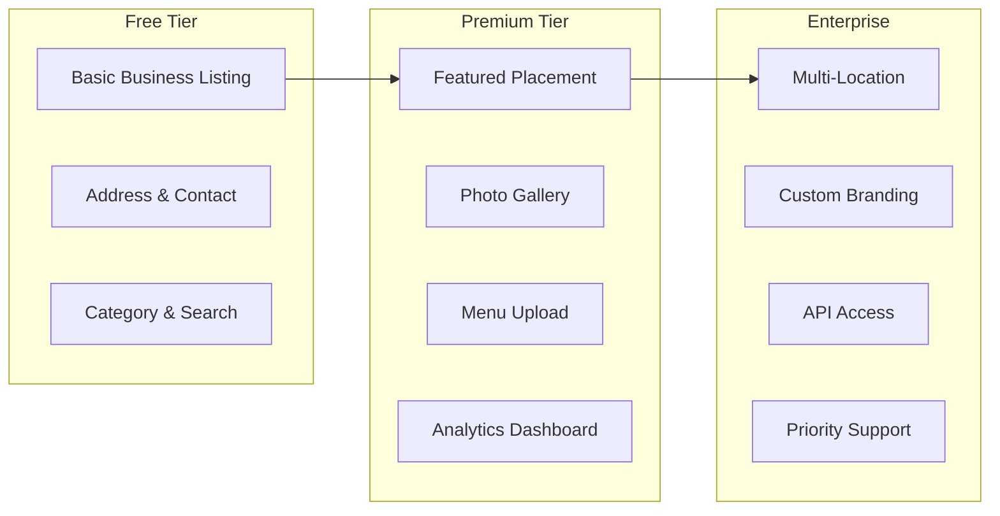

# 📊 Market Research & Analysis – Business Directory Platforms

## 1. Overview of Analyzed Platforms

| Platform | License | Category | Target Audience |
|----------|---------|----------|-----------------|
| Google Maps / Google Business | Proprietary | General Business Directory | Global |
| Yelp | Proprietary | Restaurant & Service Reviews | USA, Europe |
| TripAdvisor | Proprietary | Tourism & Hospitality | Global Tourists |
| Foursquare / Swarm | Proprietary | Location Discovery | Urban Users |
| Gelbe Seiten (DE) | Proprietary | German Business Directory | Germany |
| Das Örtliche (DE) | Proprietary | Local Business Finder | Germany |
| GoLocal (DE) | Proprietary | Local Discovery | Germany |
| KurdishFood (Niche) | Community | Kurdish Restaurant Listing | Kurdish Diaspora |
| Halal Trip | Proprietary | Muslim-friendly Travel | Muslim Travelers |
| Zomato | Proprietary | Restaurant Discovery | Global |

---

## 2. Detailed Platform Analysis

### 2.1 Google Maps / Google Business Profile

**Description:** The dominant global platform for business discovery with map-based search, reviews, and rich business profiles.

**Services:**
- Business listing with photos, hours, menu
- User reviews and ratings
- Directions and navigation
- "Near me" search
- Google Business Profile for owners
- Street View integration

**Target Users:** Everyone – global reach

**Strengths:**
- Massive user base and trust
- Excellent map and navigation
- SEO integration (Google Search)
- Free for business owners
- Rich API ecosystem

**Weaknesses:**
- No cultural/community focus
- Kurdish businesses get lost among millions
- No multilingual Kurdish interface
- Reviews can be manipulated
- Data is owned by Google
- No community or diaspora features

---

### 2.2 Yelp

**Description:** Review-focused platform for local business discovery, especially restaurants and services.

**Strengths:**
- Strong review and rating culture
- Detailed business profiles
- Photo galleries
- Booking integration

**Weaknesses:**
- Primarily US-focused
- Aggressive monetization (paid placements)
- No Kurdish or diaspora features
- Limited presence in Germany
- No cultural filtering

---

### 2.3 Gelbe Seiten (Yellow Pages Germany)

**Description:** Germany's traditional business directory, digitized for web and mobile.

**Strengths:**
- High trust in German market
- Comprehensive business data
- German-focused SEO
- Mobile app available

**Weaknesses:**
- Outdated UI/UX
- No cultural or ethnic filtering
- German-only interface
- No community features
- No specialized categories for Kurdish businesses

---

## 3. Gap Analysis – Why KurdMap?

### 3.1 Feature Comparison Matrix

| Feature | Google Maps | Yelp | Gelbe Seiten | TripAdvisor | **KurdMap** |
|---------|:----------:|:----:|:------------:|:-----------:|:-----------:|
| Kurdish language | ❌ | ❌ | ❌ | ❌ | ✅ |
| RTL layout | ❌ | ❌ | ❌ | ❌ | ✅ |
| Kurdish category filter | ❌ | ❌ | ❌ | ❌ | ✅ |
| German language | ✅ | ⚠️ | ✅ | ✅ | ✅ |
| Map integration | ✅ | ✅ | ✅ | ✅ | ✅ |
| Business profiles | ✅ | ✅ | ✅ | ✅ | ✅ |
| Menu display | ⚠️ | ✅ | ❌ | ✅ | ✅ |
| Cultural events | ❌ | ❌ | ❌ | ❌ | ✅ (Phase 2) |
| Verified businesses | ✅ | ✅ | ✅ | ✅ | ✅ |
| Community focus | ❌ | ⚠️ | ❌ | ❌ | ✅ |
| Free for owners | ✅ | ⚠️ | ⚠️ | ⚠️ | ✅ |
| Admin panel | ❌ | ❌ | ❌ | ❌ | ✅ |
| Open data | ❌ | ❌ | ❌ | ❌ | ✅ |

✅ = Fully supported | ⚠️ = Partial | ❌ = Not available

---

## 4. Target Market Analysis

### 4.1 Kurdish Diaspora in Germany

- **Estimated Kurdish population in Germany:** ~1.2 million
- **NRW (North Rhine-Westphalia):** Largest concentration (~400,000)
- **Köln:** Significant Kurdish community with active businesses
- **Düsseldorf:** Growing Kurdish business scene

### 4.2 Tourism Statistics

| City | Annual Tourists | Hotel Nights (2024) | Key Attraction |
|------|:--------------:|:-------------------:|----------------|
| Köln | ~7 million | ~9 million | Kölner Dom, Karneval |
| Düsseldorf | ~5 million | ~6 million | Altstadt, Fashion, Japantown |

### 4.3 Kurdish Business Categories (Estimated in Köln + Düsseldorf)

| Category | Estimated Count | Market Potential |
|----------|:--------------:|:----------------:|
| Restaurants & Cafés | 80–120 | 🔥 High |
| Barbershops & Salons | 50–80 | 🔥 High |
| Grocery & Markets | 40–60 | ⚡ Medium |
| Travel Agencies | 15–25 | ⚡ Medium |
| Legal & Translation | 20–30 | ⚡ Medium |
| Medical & Health | 10–20 | ⚡ Medium |
| Hotels & Accommodation | 5–10 | 💡 Low |
| Cultural Centers | 10–15 | 💡 Low |

---

## 5. Competitive Advantage

### 5.1 KurdMap's Unique Selling Points (USP)

| USP | Description |
|-----|-------------|
| **Cultural Identity** | Built by and for the Kurdish community |
| **Multilingual (4 languages)** | Kurdish Sorani, Kurmanji, German, English |
| **RTL-First Design** | Native support for Kurdish readers |
| **Verified Listings** | Admin-verified businesses ensure trust |
| **Local Focus** | Deep knowledge of Köln & Düsseldorf Kurdish scene |
| **Free for Business Owners** | No paywall for basic listings |
| **Modern Tech Stack** | Fast, SEO-optimized, mobile-first |
| **Expandable** | Architecture supports adding new cities and features |

### 5.2 Monetization Strategy (Future)

---

## 6. Technology Decision: Why This Stack?

### 6.1 Backend: ASP.NET Core 10

| Alternative | Pros | Cons | Decision |
|-------------|------|------|:--------:|
| **ASP.NET Core 10** | High performance, type-safe, mature ecosystem, Identity built-in | Windows-origin stigma | ✅ Chosen |
| Node.js (Express/NestJS) | Large community, JS ecosystem | Weak typing, callback complexity | ❌ |
| Django (Python) | Rapid prototyping, admin panel built-in | GIL, slower at scale | ❌ |
| Spring Boot (Java) | Enterprise-grade, JVM ecosystem | Verbose, slow startup | ❌ |
| Go (Gin/Echo) | Extremely fast, small binary | Small ecosystem for web apps, manual ORM | ❌ |

### 6.2 Frontend: Angular 19+

| Alternative | Pros | Cons | Decision |
|-------------|------|------|:--------:|
| **Angular 19+** | Full framework, TypeScript-first, SSR, i18n built-in | Steep learning curve | ✅ Chosen |
| React (Next.js) | Large community, flexible | No built-in i18n, needs many libraries | ❌ |
| Vue.js (Nuxt) | Easy to learn, lightweight | Smaller enterprise adoption | ❌ |
| Svelte (SvelteKit) | Fast, small bundle | Young ecosystem, small community | ❌ |

### 6.3 Admin Panel: Blazor Server

| Alternative | Pros | Cons | Decision |
|-------------|------|------|:--------:|
| **Blazor Server** | C# full-stack, shared DTOs, real-time via SignalR | Requires persistent connection | ✅ Chosen |
| Angular (separate app) | Code reuse with frontend | Duplicate frontend effort | ❌ |
| React Admin | Feature-rich, data-admin focused | Different tech stack | ❌ |
| Blazor WASM | Offline capability | Large download size, slow startup | ❌ |

### 6.4 Database: PostgreSQL

| Alternative | Pros | Cons | Decision |
|-------------|------|------|:--------:|
| **PostgreSQL 16+** | JSONB, full-text search, GIS (PostGIS), free | Slightly complex setup | ✅ Chosen |
| SQL Server | .NET integration, SSMS | License cost, Windows-centric | ❌ |
| MySQL/MariaDB | Popular, simple | Weaker JSON support, no rich FTS | ❌ |
| MongoDB | Flexible schema, JSON-native | No ACID by default, schema sprawl | ❌ |
