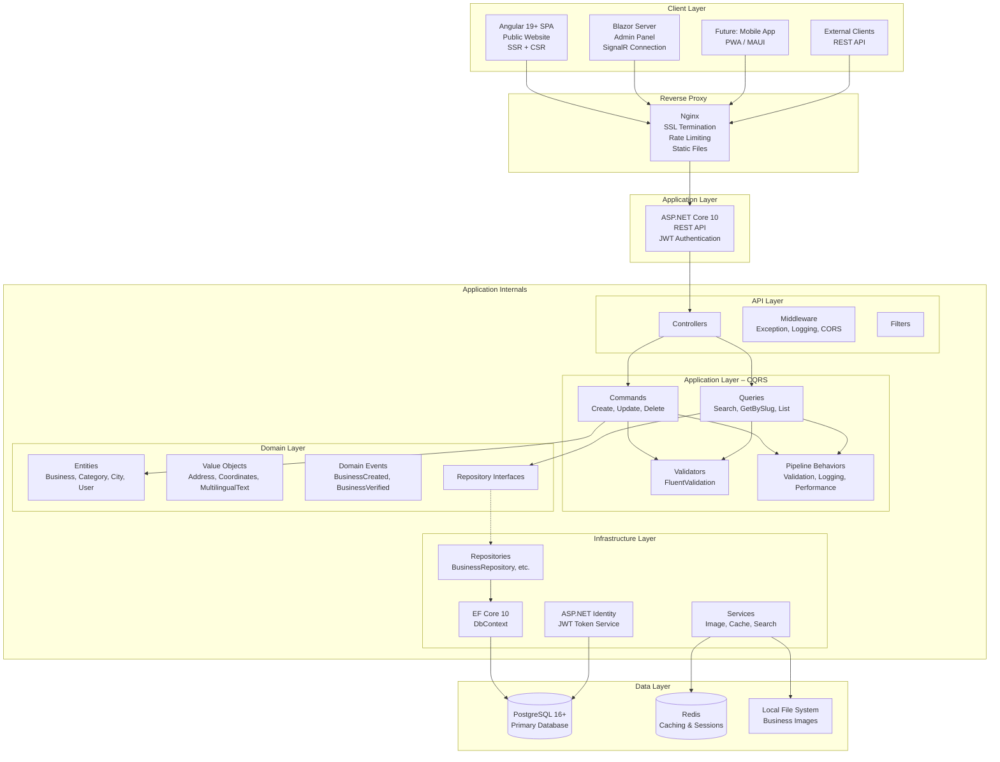
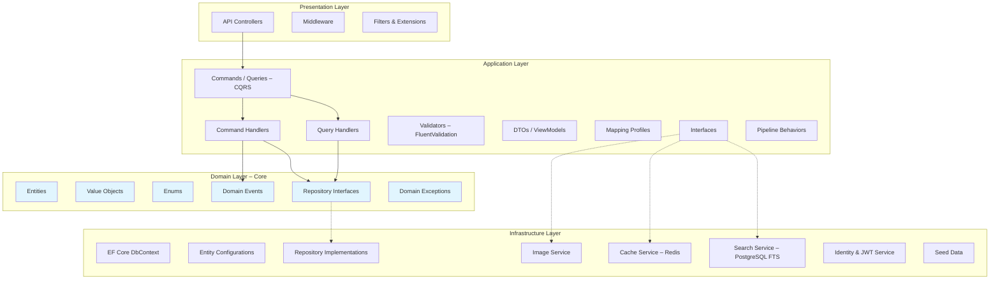
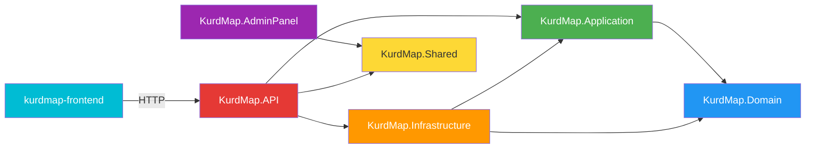
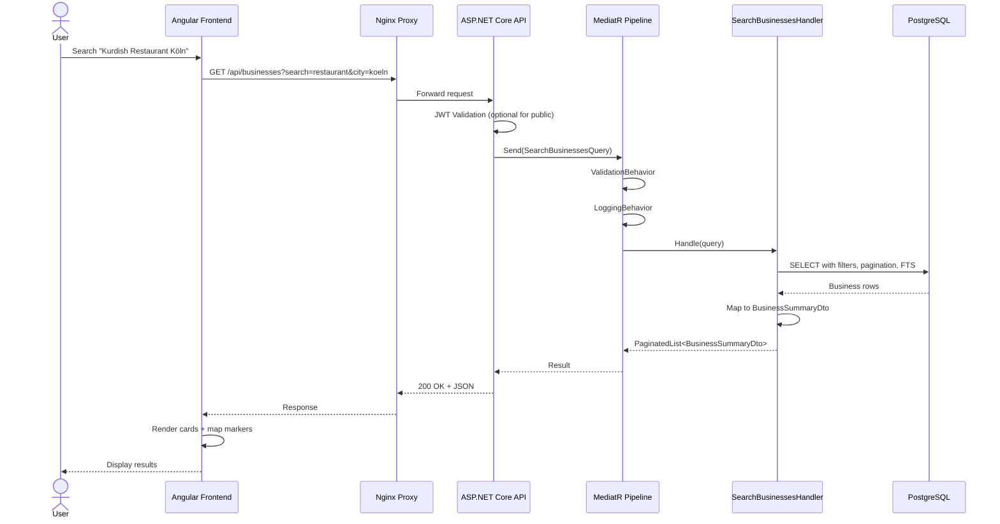

# 🏗️ System Architecture – KurdMap

## 1. Architecture Overview

KurdMap uses a **Service-Oriented Architecture** with three independently deployable services communicating through a REST API. This separation enables independent development, deployment, and scaling of each service.

### 1.1 Architecture Decision: Service-Oriented vs. Alternatives

| Approach | Pros | Cons | Decision |
|----------|------|------|:--------:|
| **3 Services (API + Frontend + Admin)** | Clear separation, independent deployment, team autonomy | Network overhead between services | ✅ Chosen |
| Monolith (all-in-one) | Simple deployment, no network latency | Tight coupling, single point of failure | ❌ |
| Microservices | Maximum scalability, polyglot | Over-engineering for this scope, DevOps complexity | ❌ |
| Serverless | Auto-scaling, pay-per-use | Cold starts, vendor lock-in, state management | ❌ |

---

## 2. High-Level Architecture Diagram



---

## 3. Clean Architecture – Layer Model



### Dependency Rule

> **Domain has ZERO external dependencies.** Application depends only on Domain. Infrastructure implements interfaces defined in Domain/Application. API wires everything together via DI.



---

## 4. Project Structure

```
KurdMap-web-all/
├── src/
│   ├── KurdMap.Domain/                        # Domain Layer (ZERO dependencies)
│   │   ├── Common/
│   │   │   ├── BaseEntity.cs                  # Id (Guid), CreatedAt, UpdatedAt
│   │   │   ├── AuditableEntity.cs             # CreatedBy, UpdatedBy
│   │   │   ├── ValueObject.cs                 # Base class for value objects
│   │   │   └── IDomainEvent.cs
│   │   ├── Businesses/
│   │   │   ├── Entities/
│   │   │   │   ├── Business.cs                # Aggregate root
│   │   │   │   ├── BusinessImage.cs
│   │   │   │   ├── BusinessService.cs
│   │   │   │   └── MenuItem.cs
│   │   │   ├── ValueObjects/
│   │   │   │   ├── Address.cs
│   │   │   │   ├── Coordinates.cs
│   │   │   │   ├── MultilingualText.cs
│   │   │   │   └── OpeningHours.cs
│   │   │   ├── Events/
│   │   │   │   ├── BusinessCreatedEvent.cs
│   │   │   │   ├── BusinessVerifiedEvent.cs
│   │   │   │   └── BusinessDeactivatedEvent.cs
│   │   │   └── IBusinessRepository.cs
│   │   ├── Categories/
│   │   │   ├── Entities/
│   │   │   │   └── Category.cs
│   │   │   └── ICategoryRepository.cs
│   │   ├── Cities/
│   │   │   ├── Entities/
│   │   │   │   └── City.cs
│   │   │   └── ICityRepository.cs
│   │   ├── Users/
│   │   │   ├── Entities/
│   │   │   │   └── ApplicationUser.cs
│   │   │   └── IUserRepository.cs
│   │   └── Enums/
│   │       ├── BusinessStatus.cs              # Pending, Active, Rejected, Deactivated
│   │       └── UserRole.cs                    # SuperAdmin, Admin, Moderator, BusinessOwner, User
│   │
│   ├── KurdMap.Application/                   # Application Layer
│   │   ├── Common/
│   │   │   ├── Behaviors/
│   │   │   │   ├── ValidationBehavior.cs
│   │   │   │   ├── LoggingBehavior.cs
│   │   │   │   └── PerformanceBehavior.cs
│   │   │   ├── Interfaces/
│   │   │   │   ├── IApplicationDbContext.cs
│   │   │   │   ├── ICurrentUserService.cs
│   │   │   │   ├── IImageService.cs
│   │   │   │   ├── ICacheService.cs
│   │   │   │   └── ISearchService.cs
│   │   │   ├── Mappings/
│   │   │   │   └── MappingProfile.cs
│   │   │   ├── Models/
│   │   │   │   ├── Result.cs
│   │   │   │   └── PaginatedList.cs
│   │   │   └── Exceptions/
│   │   │       ├── ValidationException.cs
│   │   │       ├── NotFoundException.cs
│   │   │       └── ForbiddenAccessException.cs
│   │   ├── Businesses/
│   │   │   ├── Commands/
│   │   │   │   ├── CreateBusiness/
│   │   │   │   │   ├── CreateBusinessCommand.cs
│   │   │   │   │   ├── CreateBusinessCommandHandler.cs
│   │   │   │   │   └── CreateBusinessCommandValidator.cs
│   │   │   │   ├── UpdateBusiness/
│   │   │   │   ├── DeleteBusiness/
│   │   │   │   ├── VerifyBusiness/
│   │   │   │   └── UploadBusinessImage/
│   │   │   ├── Queries/
│   │   │   │   ├── GetBusinessBySlug/
│   │   │   │   ├── SearchBusinesses/
│   │   │   │   └── GetBusinessesByCategory/
│   │   │   ├── DTOs/
│   │   │   │   ├── BusinessDetailDto.cs
│   │   │   │   ├── BusinessSummaryDto.cs
│   │   │   │   └── BusinessListDto.cs
│   │   │   └── EventHandlers/
│   │   │       ├── BusinessCreatedEventHandler.cs
│   │   │       └── BusinessVerifiedEventHandler.cs
│   │   ├── Categories/
│   │   │   ├── Queries/
│   │   │   └── DTOs/
│   │   ├── Cities/
│   │   │   ├── Queries/
│   │   │   └── DTOs/
│   │   └── DependencyInjection.cs
│   │
│   ├── KurdMap.Infrastructure/                # Infrastructure Layer
│   │   ├── Persistence/
│   │   │   ├── AppDbContext.cs
│   │   │   ├── Configurations/
│   │   │   │   ├── BusinessConfiguration.cs
│   │   │   │   ├── BusinessImageConfiguration.cs
│   │   │   │   ├── BusinessServiceConfiguration.cs
│   │   │   │   ├── MenuItemConfiguration.cs
│   │   │   │   ├── CategoryConfiguration.cs
│   │   │   │   ├── CityConfiguration.cs
│   │   │   │   └── UserConfiguration.cs
│   │   │   ├── Migrations/
│   │   │   ├── Repositories/
│   │   │   │   ├── BusinessRepository.cs
│   │   │   │   ├── CategoryRepository.cs
│   │   │   │   ├── CityRepository.cs
│   │   │   │   └── UnitOfWork.cs
│   │   │   ├── Interceptors/
│   │   │   │   ├── AuditableEntityInterceptor.cs
│   │   │   │   └── SoftDeleteInterceptor.cs
│   │   │   └── Seed/
│   │   │       ├── CategorySeed.cs
│   │   │       ├── CitySeed.cs
│   │   │       └── AdminUserSeed.cs
│   │   ├── Services/
│   │   │   ├── ImageService.cs
│   │   │   ├── CacheService.cs
│   │   │   ├── SearchService.cs
│   │   │   └── CurrentUserService.cs
│   │   ├── Identity/
│   │   │   ├── IdentityService.cs
│   │   │   └── JwtTokenService.cs
│   │   └── DependencyInjection.cs
│   │
│   ├── KurdMap.API/                           # API Layer (Entry Point)
│   │   ├── Controllers/
│   │   │   ├── BusinessesController.cs
│   │   │   ├── CategoriesController.cs
│   │   │   ├── CitiesController.cs
│   │   │   ├── AuthController.cs
│   │   │   ├── ImagesController.cs
│   │   │   └── AdminController.cs
│   │   ├── Middleware/
│   │   │   ├── ExceptionHandlingMiddleware.cs
│   │   │   ├── RequestLoggingMiddleware.cs
│   │   │   └── CorrelationIdMiddleware.cs
│   │   ├── Filters/
│   │   │   └── ApiExceptionFilterAttribute.cs
│   │   ├── appsettings.json
│   │   ├── appsettings.Development.json
│   │   └── Program.cs
│   │
│   ├── KurdMap.Shared/                        # Shared DTOs & Contracts
│   │   ├── DTOs/
│   │   │   ├── BusinessDto.cs
│   │   │   ├── CategoryDto.cs
│   │   │   ├── CityDto.cs
│   │   │   └── AuthDto.cs
│   │   ├── Constants/
│   │   │   └── Roles.cs
│   │   └── Enums/
│   │       └── BusinessStatus.cs
│   │
│   ├── KurdMap.AdminPanel/                    # Blazor Server Admin Panel
│   │   ├── Pages/
│   │   │   ├── Dashboard.razor
│   │   │   ├── Businesses/
│   │   │   │   ├── BusinessList.razor
│   │   │   │   ├── BusinessForm.razor
│   │   │   │   └── BusinessDetail.razor
│   │   │   ├── Users/
│   │   │   │   └── UserList.razor
│   │   │   ├── Categories/
│   │   │   │   └── CategoryManagement.razor
│   │   │   └── Settings/
│   │   │       └── SiteSettings.razor
│   │   ├── Components/
│   │   │   ├── Layout/
│   │   │   │   ├── MainLayout.razor
│   │   │   │   └── NavMenu.razor
│   │   │   └── Shared/
│   │   │       ├── MultilingualInput.razor
│   │   │       ├── ImageUpload.razor
│   │   │       └── ConfirmDialog.razor
│   │   ├── Services/
│   │   │   ├── ApiClient.cs
│   │   │   └── AuthService.cs
│   │   ├── wwwroot/
│   │   └── Program.cs
│   │
│   └── kurdmap-frontend/                      # Angular 19+ Frontend
│       ├── src/
│       │   ├── app/
│       │   │   ├── core/
│       │   │   │   ├── services/
│       │   │   │   │   ├── business.service.ts
│       │   │   │   │   ├── category.service.ts
│       │   │   │   │   ├── city.service.ts
│       │   │   │   │   └── auth.service.ts
│       │   │   │   ├── interceptors/
│       │   │   │   │   ├── auth.interceptor.ts
│       │   │   │   │   └── error.interceptor.ts
│       │   │   │   ├── guards/
│       │   │   │   │   └── auth.guard.ts
│       │   │   │   └── models/
│       │   │   │       ├── business.model.ts
│       │   │   │       ├── category.model.ts
│       │   │   │       └── paginated-list.model.ts
│       │   │   ├── features/
│       │   │   │   ├── home/
│       │   │   │   │   ├── home.component.ts
│       │   │   │   │   └── home.routes.ts
│       │   │   │   ├── search/
│       │   │   │   │   ├── search.component.ts
│       │   │   │   │   ├── search-filters.component.ts
│       │   │   │   │   ├── search-map.component.ts
│       │   │   │   │   └── search.routes.ts
│       │   │   │   ├── business-detail/
│       │   │   │   │   ├── business-detail.component.ts
│       │   │   │   │   ├── business-gallery.component.ts
│       │   │   │   │   ├── business-map.component.ts
│       │   │   │   │   └── business-detail.routes.ts
│       │   │   │   └── contact/
│       │   │   ├── shared/
│       │   │   │   ├── components/
│       │   │   │   │   ├── header/
│       │   │   │   │   ├── footer/
│       │   │   │   │   ├── language-switcher/
│       │   │   │   │   ├── business-card/
│       │   │   │   │   └── loading-skeleton/
│       │   │   │   ├── directives/
│       │   │   │   │   └── rtl.directive.ts
│       │   │   │   └── pipes/
│       │   │   │       └── multilingual.pipe.ts
│       │   │   └── app.routes.ts
│       │   ├── assets/
│       │   │   ├── i18n/
│       │   │   │   ├── ku-sor.json
│       │   │   │   ├── ku-kur.json
│       │   │   │   ├── de.json
│       │   │   │   ├── en.json
│       │   │   │   └── fa.json
│       │   │   └── images/
│       │   ├── environments/
│       │   └── styles/
│       │       ├── styles.scss
│       │       └── _rtl.scss
│       ├── angular.json
│       ├── tailwind.config.js
│       └── package.json
│
├── tests/
│   ├── KurdMap.Domain.Tests/
│   │   └── Businesses/
│   ├── KurdMap.Application.Tests/
│   │   └── Businesses/
│   │       ├── Commands/
│   │       └── Queries/
│   ├── KurdMap.Infrastructure.Tests/
│   └── KurdMap.API.Tests/
│       └── Controllers/
│
├── docker/
│   ├── docker-compose.yml
│   ├── docker-compose.override.yml
│   ├── Dockerfile.api
│   ├── Dockerfile.admin
│   └── Dockerfile.frontend
│
├── Docs/
│   └── Plan/
│
├── .github/
│   ├── workflows/
│   │   └── ci.yml
│   ├── skills/
│   │   └── prompt/
│   │       └── SKILL.md
│   └── prompts/
│       └── p.prompt.md
│
├── KurdMap.sln
├── .gitignore
├── .editorconfig
└── README.md
```

---

## 5. Component Diagram

```mermaid
graph LR
    subgraph "Angular Frontend Components"
        HC[Home Page]
        SC[Search Page]
        BDC[Business Detail]
        CC[Contact Page]
        LS[Language Switcher]
    end

    subgraph "API Endpoints"
        BA[/api/businesses]
        CA[/api/categories]
        CIA[/api/cities]
        AA[/api/auth]
        IA[/api/images]
        ADMA[/api/admin]
    end

    subgraph "Blazor Admin Pages"
        DASH[Dashboard]
        BM[Business Management]
        UM[User Management]
        CM[Category Management]
    end

    SC --> BA
    SC --> CA
    SC --> CIA
    BDC --> BA
    HC --> CA
    HC --> BA
    DASH --> ADMA
    BM --> BA
    BM --> IA
    UM --> ADMA
    CM --> CA
```

---

## 6. Request Flow (Search Example)



---

## 7. Technology Alternatives Summary

| Component | Chosen | Alternative 1 | Alternative 2 | Alternative 3 |
|-----------|--------|--------------|--------------|---------------|
| **Runtime** | ASP.NET Core 10 | Node.js | Go | Spring Boot |
| **ORM** | EF Core 10 | Dapper | Npgsql (raw) | LINQ to DB |
| **CQRS** | MediatR | No library (manual) | Wolverine | Brighter |
| **Validation** | FluentValidation | Data Annotations | Manual | |
| **Mapping** | Mapster | AutoMapper | Manual mapping | |
| **Logging** | Serilog | NLog | Built-in ILogger | |
| **Caching** | Redis | IMemoryCache | NCache | |
| **Search** | PostgreSQL FTS | Elasticsearch | Algolia | Meilisearch |
| **Auth** | JWT + Identity | Keycloak | Auth0 | IdentityServer |
| **Frontend** | Angular 19+ | React (Next.js) | Vue (Nuxt) | Svelte |
| **UI Library** | Tailwind CSS | Angular Material | PrimeNG | Bootstrap |
| **Maps** | Leaflet + OSM | Google Maps API | Mapbox | |
| **Admin UI** | MudBlazor | FluentUI Blazor | Radzen | |
| **Database** | PostgreSQL 16+ | SQL Server | MySQL | MongoDB |
| **Container** | Docker + Compose | Podman | Kubernetes | |
| **CI/CD** | GitHub Actions | GitLab CI | Azure DevOps | Jenkins |
| **Proxy** | Nginx | YARP | Traefik | Caddy |
| **Hosting** | Hetzner VPS | DigitalOcean | Azure | AWS |
