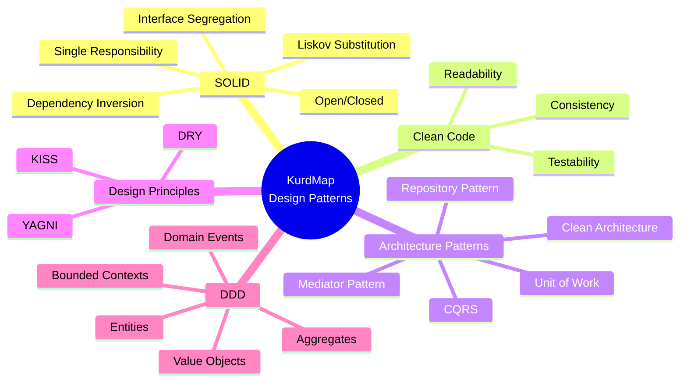
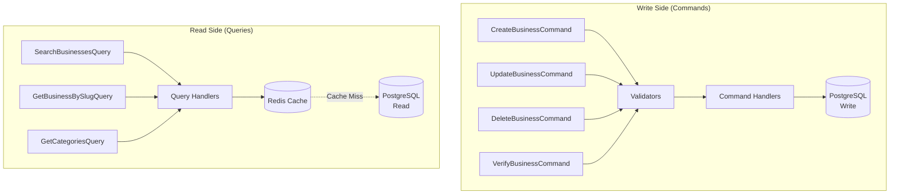
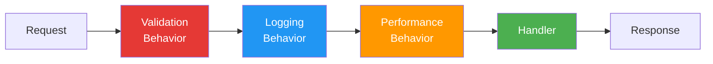
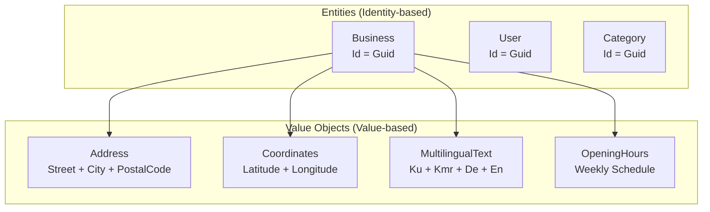
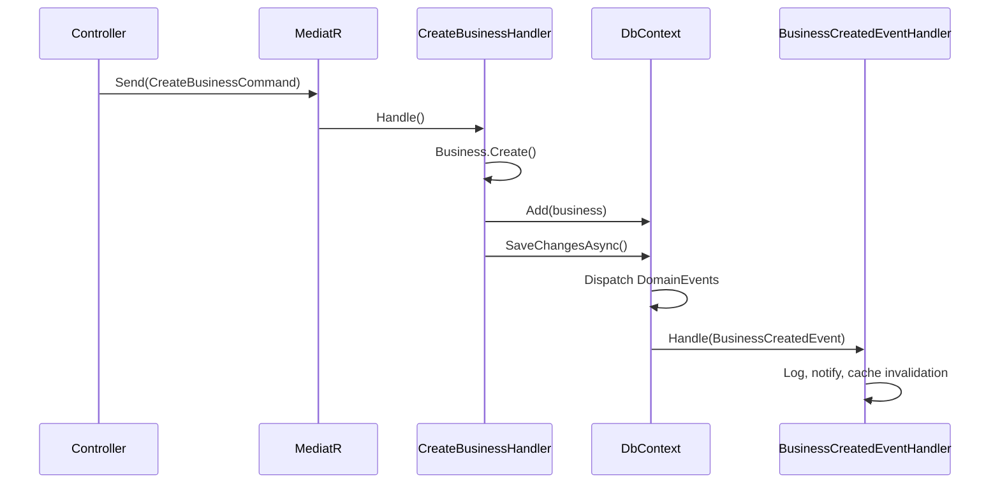

# 🧩 Design Patterns & Principles – KurdMap

## 1. Overview of Applied Patterns and Principles



---

## 2. SOLID Principles

### 2.1 Single Responsibility Principle (SRP)

**Principle:** Each class has exactly one responsibility and only one reason to change.

**Application in KurdMap:**

```csharp
// ❌ WRONG: Class with multiple responsibilities
public class BusinessService
{
    public Business CreateBusiness(CreateBusinessDto dto) { /* ... */ }
    public void SendVerificationEmail(Business business) { /* ... */ }
    public void ValidateBusiness(Business business) { /* ... */ }
    public byte[] GenerateBusinessReport(List<Business> businesses) { /* ... */ }
    public void UploadImage(Stream imageStream) { /* ... */ }
}

// ✅ CORRECT: Each class has one responsibility
public class CreateBusinessCommandHandler : IRequestHandler<CreateBusinessCommand, BusinessDto>
{
    // Only responsible for creating a business
}

public class BusinessCreatedEventHandler : INotificationHandler<BusinessCreatedEvent>
{
    // Only responsible for side effects after business creation
}

public class CreateBusinessCommandValidator : AbstractValidator<CreateBusinessCommand>
{
    // Only responsible for validation
}

public class ImageService : IImageService
{
    // Only responsible for image processing and storage
}
```

---

### 2.2 Open/Closed Principle (OCP)

**Principle:** Classes are open for extension but closed for modification.

**Application in KurdMap:**

```csharp
// Base search strategy — extensible without modifying existing code
public interface IBusinessSearchStrategy
{
    Task<PaginatedList<BusinessSummaryDto>> SearchAsync(
        SearchBusinessesQuery query, CancellationToken ct);
    bool CanHandle(SearchType type);
}

// Full-text search via PostgreSQL
public class FullTextSearchStrategy : IBusinessSearchStrategy
{
    public bool CanHandle(SearchType type) => type == SearchType.FullText;
    public async Task<PaginatedList<BusinessSummaryDto>> SearchAsync(
        SearchBusinessesQuery query, CancellationToken ct)
    {
        // PostgreSQL FTS search
    }
}

// Location-based search (near me)
public class GeoSearchStrategy : IBusinessSearchStrategy
{
    public bool CanHandle(SearchType type) => type == SearchType.NearMe;
    public async Task<PaginatedList<BusinessSummaryDto>> SearchAsync(
        SearchBusinessesQuery query, CancellationToken ct)
    {
        // PostGIS distance-based search
    }
}

// Future: Add new search strategy without changing existing code
public class AiSearchStrategy : IBusinessSearchStrategy
{
    public bool CanHandle(SearchType type) => type == SearchType.Semantic;
    public async Task<PaginatedList<BusinessSummaryDto>> SearchAsync(
        SearchBusinessesQuery query, CancellationToken ct)
    {
        // AI-powered semantic search
    }
}
```

---

### 2.3 Liskov Substitution Principle (LSP)

**Principle:** Subtypes must be substitutable for their base types without changing correctness.

```csharp
// Base entity — all entities follow this contract
public abstract class BaseEntity
{
    public Guid Id { get; protected set; }
    public DateTime CreatedAt { get; protected set; }
    public DateTime UpdatedAt { get; protected set; }
}

// Business extends BaseEntity — fully substitutable
public class Business : BaseEntity
{
    public MultilingualText Name { get; private set; }
    public string Slug { get; private set; }
    public Address Address { get; private set; }
    // ...
}

// Category extends BaseEntity — fully substitutable
public class Category : BaseEntity
{
    public MultilingualText Name { get; private set; }
    public string Slug { get; private set; }
    public string Icon { get; private set; }
}
```

---

### 2.4 Interface Segregation Principle (ISP)

**Principle:** Clients should not be forced to depend on interfaces they do not use.

```csharp
// ❌ WRONG: One fat interface
public interface IBusinessRepository
{
    Task<Business> GetByIdAsync(Guid id);
    Task<Business> GetBySlugAsync(string slug);
    Task<PaginatedList<Business>> SearchAsync(SearchParams p);
    Task AddAsync(Business business);
    Task UpdateAsync(Business business);
    Task DeleteAsync(Guid id);
    Task<byte[]> GenerateReportAsync();  // Not every consumer needs this
    Task SendNotificationAsync();         // Doesn't belong here
}

// ✅ CORRECT: Segregated interfaces
public interface IBusinessReadRepository
{
    Task<Business?> GetByIdAsync(Guid id, CancellationToken ct);
    Task<Business?> GetBySlugAsync(string slug, CancellationToken ct);
    Task<PaginatedList<Business>> SearchAsync(SearchParams p, CancellationToken ct);
}

public interface IBusinessWriteRepository
{
    Task AddAsync(Business business, CancellationToken ct);
    Task UpdateAsync(Business business, CancellationToken ct);
    Task SoftDeleteAsync(Guid id, CancellationToken ct);
}

public interface IUnitOfWork
{
    Task<int> SaveChangesAsync(CancellationToken ct);
}
```

---

### 2.5 Dependency Inversion Principle (DIP)

**Principle:** High-level modules should not depend on low-level modules. Both should depend on abstractions.

```csharp
// Domain Layer — defines the interface (abstraction)
public interface IBusinessRepository
{
    Task<Business?> GetBySlugAsync(string slug, CancellationToken ct);
}

// Application Layer — depends on abstraction, not implementation
public class GetBusinessBySlugQueryHandler
    : IRequestHandler<GetBusinessBySlugQuery, BusinessDetailDto?>
{
    private readonly IBusinessRepository _repository;  // Abstraction!

    public GetBusinessBySlugQueryHandler(IBusinessRepository repository)
    {
        _repository = repository;
    }

    public async Task<BusinessDetailDto?> Handle(
        GetBusinessBySlugQuery query, CancellationToken ct)
    {
        var business = await _repository.GetBySlugAsync(query.Slug, ct);
        return business?.ToDetailDto();
    }
}

// Infrastructure Layer — provides the implementation
public class BusinessRepository : IBusinessRepository
{
    private readonly AppDbContext _context;

    public BusinessRepository(AppDbContext context)
    {
        _context = context;
    }

    public async Task<Business?> GetBySlugAsync(string slug, CancellationToken ct)
    {
        return await _context.Businesses
            .Include(b => b.Images)
            .Include(b => b.Services)
            .Include(b => b.MenuItems)
            .FirstOrDefaultAsync(b => b.Slug == slug, ct);
    }
}
```

---

## 3. Architecture Patterns

### 3.1 CQRS (Command Query Responsibility Segregation)



**Why CQRS for KurdMap:**
- **Read-heavy workload**: Users search and browse far more than admins create/edit
- **Different optimization needs**: Reads need caching + full-text search; writes need validation + events
- **Separation of concerns**: Keeps command and query logic clean and testable

### 3.2 Mediator Pattern (MediatR)

```csharp
// Controller uses MediatR — no direct dependency on handlers
[ApiController]
[Route("api/[controller]")]
public class BusinessesController : ControllerBase
{
    private readonly ISender _sender;

    public BusinessesController(ISender sender)
    {
        _sender = sender;
    }

    [HttpGet("{slug}")]
    public async Task<ActionResult<BusinessDetailDto>> GetBySlug(
        string slug, CancellationToken ct)
    {
        var result = await _sender.Send(new GetBusinessBySlugQuery(slug), ct);
        return result is null ? NotFound() : Ok(result);
    }

    [HttpGet]
    public async Task<ActionResult<PaginatedList<BusinessSummaryDto>>> Search(
        [FromQuery] SearchBusinessesQuery query, CancellationToken ct)
    {
        return Ok(await _sender.Send(query, ct));
    }

    [HttpPost]
    [Authorize(Policy = AuthorizationPolicies.AdminOnly)]
    public async Task<ActionResult<BusinessDto>> Create(
        CreateBusinessCommand command, CancellationToken ct)
    {
        var result = await _sender.Send(command, ct);
        return CreatedAtAction(nameof(GetBySlug),
            new { slug = result.Slug }, result);
    }
}
```

### 3.3 MediatR Pipeline Behaviors



```csharp
// Validation Behavior — runs FluentValidation before every handler
public class ValidationBehavior<TRequest, TResponse>
    : IPipelineBehavior<TRequest, TResponse>
    where TRequest : notnull
{
    private readonly IEnumerable<IValidator<TRequest>> _validators;

    public ValidationBehavior(IEnumerable<IValidator<TRequest>> validators)
    {
        _validators = validators;
    }

    public async Task<TResponse> Handle(
        TRequest request,
        RequestHandlerDelegate<TResponse> next,
        CancellationToken ct)
    {
        if (!_validators.Any()) return await next();

        var context = new ValidationContext<TRequest>(request);
        var failures = (await Task.WhenAll(
            _validators.Select(v => v.ValidateAsync(context, ct))))
            .SelectMany(r => r.Errors)
            .Where(f => f is not null)
            .ToList();

        if (failures.Count != 0)
            throw new ValidationException(failures);

        return await next();
    }
}
```

---

## 4. Domain-Driven Design (DDD) Concepts

### 4.1 Entities vs. Value Objects



```csharp
// Value Object — equality by value, immutable
public sealed record Address
{
    public string Street { get; init; }
    public string PostalCode { get; init; }
    public Guid CityId { get; init; }

    private Address() { } // EF Core constructor

    public static Address Create(string street, string postalCode, Guid cityId)
    {
        if (string.IsNullOrWhiteSpace(street))
            throw new DomainException("Street is required");
        if (string.IsNullOrWhiteSpace(postalCode))
            throw new DomainException("Postal code is required");

        return new Address
        {
            Street = street.Trim(),
            PostalCode = postalCode.Trim(),
            CityId = cityId
        };
    }
}

// Value Object — multilingual text for Kurdish (Sorani & Kurmanji), German, English
public sealed record MultilingualText
{
    public string Ku { get; init; } = string.Empty;    // Kurdish (Sorani)
    public string Kmr { get; init; } = string.Empty;   // Kurdish (Kurmanji)
    public string De { get; init; } = string.Empty;    // German
    public string En { get; init; } = string.Empty;    // English

    public string GetLocalized(string locale) => locale switch
    {
        "ku" or "ku-sor" => Ku,
        "kmr" or "ku-kmr" => Kmr,
        "de" => De,
        "en" => En,
        _ => De  // Default to German
    };
}

// Value Object — geographic coordinates
public sealed record Coordinates
{
    public decimal Latitude { get; init; }
    public decimal Longitude { get; init; }

    public static Coordinates Create(decimal latitude, decimal longitude)
    {
        if (latitude < -90 || latitude > 90)
            throw new DomainException("Latitude must be between -90 and 90");
        if (longitude < -180 || longitude > 180)
            throw new DomainException("Longitude must be between -180 and 180");

        return new Coordinates { Latitude = latitude, Longitude = longitude };
    }
}
```

### 4.2 Aggregate Root — Business Entity

```csharp
public class Business : AuditableEntity
{
    public MultilingualText Name { get; private set; }
    public string Slug { get; private set; }
    public MultilingualText Description { get; private set; }
    public Guid CategoryId { get; private set; }
    public Address Address { get; private set; }
    public Coordinates Location { get; private set; }
    public string? Phone { get; private set; }
    public string? Email { get; private set; }
    public string? Website { get; private set; }
    public OpeningHours? Hours { get; private set; }
    public BusinessStatus Status { get; private set; }
    public bool IsVerified { get; private set; }
    public Guid? OwnerId { get; private set; }

    // Navigation properties
    private readonly List<BusinessImage> _images = new();
    public IReadOnlyCollection<BusinessImage> Images => _images.AsReadOnly();

    private readonly List<BusinessService> _services = new();
    public IReadOnlyCollection<BusinessService> Services => _services.AsReadOnly();

    private readonly List<MenuItem> _menuItems = new();
    public IReadOnlyCollection<MenuItem> MenuItems => _menuItems.AsReadOnly();

    // Domain events
    private readonly List<IDomainEvent> _domainEvents = new();
    public IReadOnlyCollection<IDomainEvent> DomainEvents => _domainEvents.AsReadOnly();

    private Business() { } // EF Core

    // Factory method — the ONLY way to create a Business
    public static Business Create(
        MultilingualText name,
        string slug,
        MultilingualText description,
        Guid categoryId,
        Address address,
        Coordinates location)
    {
        var business = new Business
        {
            Id = Guid.NewGuid(),
            Name = name,
            Slug = slug.ToLowerInvariant(),
            Description = description,
            CategoryId = categoryId,
            Address = address,
            Location = location,
            Status = BusinessStatus.Pending,
            IsVerified = false,
            CreatedAt = DateTime.UtcNow,
            UpdatedAt = DateTime.UtcNow
        };

        business._domainEvents.Add(new BusinessCreatedEvent(business.Id));
        return business;
    }

    // Domain methods
    public void Verify()
    {
        if (IsVerified) return;
        IsVerified = true;
        Status = BusinessStatus.Active;
        UpdatedAt = DateTime.UtcNow;
        _domainEvents.Add(new BusinessVerifiedEvent(Id));
    }

    public void Deactivate()
    {
        Status = BusinessStatus.Deactivated;
        UpdatedAt = DateTime.UtcNow;
        _domainEvents.Add(new BusinessDeactivatedEvent(Id));
    }

    public void AddImage(string url, string? altText, bool isPrimary = false)
    {
        if (isPrimary)
            _images.ForEach(i => i.SetNotPrimary());

        _images.Add(BusinessImage.Create(Id, url, altText, isPrimary, _images.Count));
    }

    public void ClearDomainEvents() => _domainEvents.Clear();
}
```

### 4.3 Domain Events



---

## 5. Result Pattern for Error Handling

```csharp
// Result wrapper — no exceptions for business logic
public class Result<T>
{
    public T? Value { get; }
    public bool IsSuccess { get; }
    public string? Error { get; }

    private Result(T value) { Value = value; IsSuccess = true; }
    private Result(string error) { Error = error; IsSuccess = false; }

    public static Result<T> Success(T value) => new(value);
    public static Result<T> Failure(string error) => new(error);

    public static implicit operator Result<T>(T value) => Success(value);
}

// Usage in handler
public async Task<Result<BusinessDetailDto>> Handle(
    GetBusinessBySlugQuery query, CancellationToken ct)
{
    var business = await _repository.GetBySlugAsync(query.Slug, ct);

    if (business is null)
        return Result<BusinessDetailDto>.Failure($"Business '{query.Slug}' not found");

    return business.ToDetailDto();
}
```

---

## 6. Summary — Pattern Decision Matrix

| Pattern | Used In | Purpose | Alternative |
|---------|---------|---------|-------------|
| **Clean Architecture** | Solution-wide | Layer separation, testability | N-Tier, Hexagonal |
| **CQRS** | Application layer | Read/write separation | Traditional CRUD service |
| **MediatR** | Application layer | Decoupled request handling | Direct injection |
| **Repository** | Infrastructure | Data access abstraction | Direct DbContext usage |
| **Unit of Work** | Infrastructure | Transaction management | DbContext.SaveChanges |
| **Result Pattern** | Application layer | Error handling without exceptions | Exceptions |
| **Factory Method** | Domain entities | Controlled object creation | Public constructors |
| **Value Object** | Domain layer | Immutable, value-based equality | Primitive types |
| **Domain Events** | Domain layer | Side effects after state changes | Direct calls |
| **Strategy Pattern** | Search, notifications | Extensible behavior | Switch statements |
| **Pipeline Behaviors** | MediatR | Cross-cutting concerns | Middleware, decorators |
