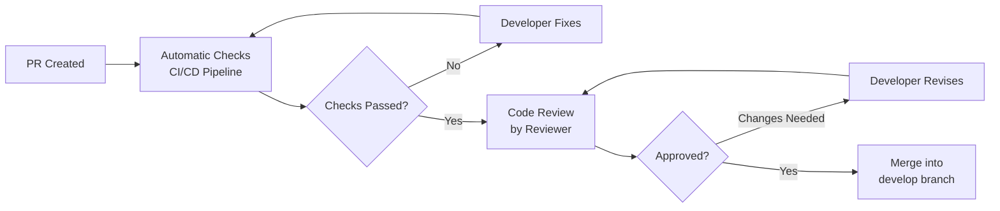
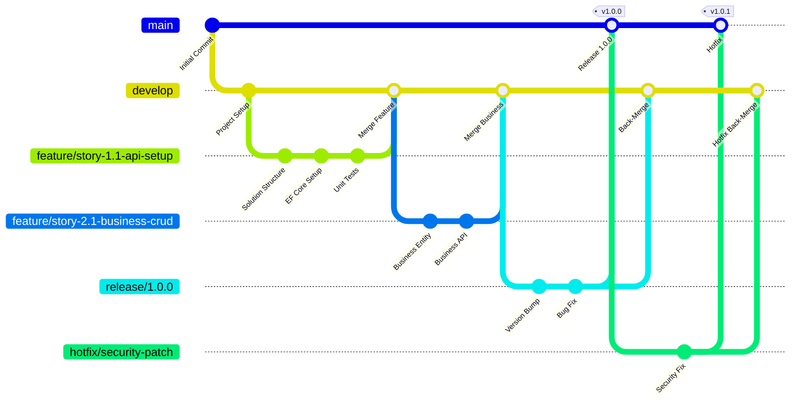

# 📝 Development Guidelines – KurdMap

## 1. Code Review Standards

### 1.1 Review Checklist

Every Pull Request must pass the following criteria:

| Category | Check Point | Required |
|----------|------------|:--------:|
| **Functionality** | Feature works as described | ✅ |
| **Tests** | Unit tests present and passing | ✅ |
| **Tests** | Integration tests for API changes | ✅ |
| **Code Quality** | No compiler warnings | ✅ |
| **Code Quality** | SOLID principles followed | ✅ |
| **Code Quality** | No duplicated code | ✅ |
| **Security** | No hardcoded credentials | ✅ |
| **Security** | Input validation present | ✅ |
| **Performance** | No N+1 query problems | ✅ |
| **Performance** | Pagination on all list endpoints | ✅ |
| **Multilingual** | All user-facing text supports 4+ languages | ✅ |
| **Documentation** | API endpoints documented (OpenAPI) | ✅ |

### 1.2 Review Process



### 1.3 Review Rules

- At least **1 reviewer** must approve
- Author cannot approve their own PR
- All automated checks must be **green**
- Reviewer should respond within **24 hours**
- Constructive feedback only — no destructive criticism

---

## 2. Git Workflow

### 2.1 Branching Strategy: Git Flow



### 2.2 Branch Types

| Branch Type | Naming Convention | Description | Base | Merge Target |
|-------------|------------------|-------------|------|:------------:|
| **main** | `main` | Production state | — | — |
| **develop** | `develop` | Development state | `main` | `release/*` |
| **feature** | `feature/{story-id}-{description}` | New features | `develop` | `develop` |
| **bugfix** | `bugfix/{issue-id}-{description}` | Bug fixes | `develop` | `develop` |
| **release** | `release/{version}` | Release preparation | `develop` | `main` + `develop` |
| **hotfix** | `hotfix/{issue-id}-{description}` | Emergency fixes | `main` | `main` + `develop` |

### 2.3 Branch Examples

```
feature/story-1.1-solution-setup
feature/story-1.2-database-migration
feature/story-1.3-authentication
feature/story-2.1-business-crud
feature/story-2.2-business-search
feature/story-3.1-angular-setup
feature/story-3.2-search-page
feature/story-4.1-admin-dashboard
bugfix/issue-12-search-pagination
release/1.0.0
hotfix/issue-42-xss-vulnerability
```

---

## 3. Commit Conventions

### 3.1 Conventional Commits

Format: `<type>(<scope>): <description>`

| Type | Description | Example |
|------|-------------|---------|
| `feat` | New feature | `feat(businesses): implement search endpoint` |
| `fix` | Bug fix | `fix(auth): correct token refresh logic` |
| `docs` | Documentation | `docs(api): update OpenAPI descriptions` |
| `style` | Formatting | `style(global): apply code formatting` |
| `refactor` | Refactoring | `refactor(businesses): simplify repository methods` |
| `test` | Tests | `test(businesses): add unit tests for CreateBusiness` |
| `chore` | Build/CI | `chore(ci): update GitHub Actions pipeline` |
| `perf` | Performance | `perf(queries): fix N+1 query in business list` |
| `security` | Security | `security(api): add CSRF token validation` |

### 3.2 Commit Rules

- Write in **imperative mood** (e.g. "Add feature", not "Added feature")
- Max **72 characters** in subject line
- Reference story/issue: `feat(businesses): implement search #story-2.2`
- One logical change per commit

---

## 4. Naming Conventions

### 4.1 C# Naming Conventions

| Element | Convention | Example |
|---------|-----------|---------|
| **Namespace** | PascalCase | `KurdMap.Domain.Businesses` |
| **Class** | PascalCase | `BusinessRepository` |
| **Interface** | I + PascalCase | `IBusinessRepository` |
| **Method** | PascalCase | `GetBySlugAsync` |
| **Property** | PascalCase | `BusinessName` |
| **Parameter** | camelCase | `businessId` |
| **Local Variable** | camelCase | `activeBusinesses` |
| **Constant** | PascalCase | `MaxNameLength` |
| **Private Field** | _camelCase | `_businessRepository` |
| **Enum** | PascalCase (Singular) | `BusinessStatus` |
| **Enum Value** | PascalCase | `InProgress` |
| **Async Method** | PascalCase + Async | `SearchBusinessesAsync` |

### 4.2 TypeScript / Angular Naming Conventions

| Element | Convention | Example |
|---------|-----------|---------|
| **File name** | kebab-case | `business-detail.component.ts` |
| **Class** | PascalCase | `BusinessDetailComponent` |
| **Interface** | PascalCase (no I prefix) | `Business`, `SearchParams` |
| **Method** | camelCase | `searchBusinesses()` |
| **Property** | camelCase | `businessList` |
| **Signal** | camelCase | `businesses = signal<Business[]>([])` |
| **Service** | PascalCase + Service | `BusinessService` |
| **Component** | PascalCase + Component | `SearchFiltersComponent` |
| **Pipe** | PascalCase + Pipe | `MultilingualPipe` |
| **Route path** | kebab-case | `/business-detail/:slug` |
| **CSS class** | kebab-case (Tailwind) | `bg-primary-500` |

### 4.3 File Naming Conventions

| Type | Convention | Example |
|------|-----------|---------|
| **Entity** | `{Name}.cs` | `Business.cs` |
| **Interface** | `I{Name}.cs` | `IBusinessRepository.cs` |
| **Command** | `{Action}{Entity}Command.cs` | `CreateBusinessCommand.cs` |
| **Command Handler** | `{Action}{Entity}CommandHandler.cs` | `CreateBusinessCommandHandler.cs` |
| **Query** | `Get{Entity}Query.cs` | `GetBusinessBySlugQuery.cs` |
| **Validator** | `{Name}Validator.cs` | `CreateBusinessCommandValidator.cs` |
| **DTO** | `{Entity}Dto.cs` | `BusinessDetailDto.cs` |
| **Controller** | `{Entity}sController.cs` | `BusinessesController.cs` |
| **Blazor Page** | `{Name}.razor` | `BusinessList.razor` |
| **Test** | `{Class}Tests.cs` | `CreateBusinessCommandHandlerTests.cs` |
| **Configuration** | `{Entity}Configuration.cs` | `BusinessConfiguration.cs` |
| **Migration** | Auto-generated | `20260401_InitialCreate.cs` |

### 4.4 API Endpoint Conventions

| Convention | Rule | Example |
|-----------|------|---------|
| **Base URL** | kebab-case, Plural | `/api/businesses` |
| **Resource** | Noun, Plural | `/businesses`, `/categories` |
| **Single Resource** | Slug or ID | `/businesses/{slug}` |
| **Sub-Resource** | Nested | `/businesses/{id}/images` |
| **Action** | Verb as sub-path | `/businesses/{id}/verify` |

### 4.5 Database Conventions

| Element | Convention | Example |
|---------|-----------|---------|
| **Table** | snake_case, Plural | `businesses`, `menu_items` |
| **Column** | snake_case | `name_ku`, `created_at` |
| **Primary Key** | `id` | `id` (uuid) |
| **Foreign Key** | `{entity}_id` | `category_id`, `city_id` |
| **Index** | `ix_{table}_{column}` | `ix_businesses_slug` |
| **Unique** | `uq_{table}_{column}` | `uq_businesses_slug` |

---

## 5. Project Structure Conventions

### 5.1 Feature Folder Structure (Vertical Slices)

```
Application/
├── Businesses/
│   ├── Commands/
│   │   ├── CreateBusiness/
│   │   │   ├── CreateBusinessCommand.cs
│   │   │   ├── CreateBusinessCommandHandler.cs
│   │   │   └── CreateBusinessCommandValidator.cs
│   │   ├── UpdateBusiness/
│   │   ├── DeleteBusiness/
│   │   └── VerifyBusiness/
│   ├── Queries/
│   │   ├── GetBusinessBySlug/
│   │   ├── SearchBusinesses/
│   │   └── GetBusinessesByCategory/
│   ├── DTOs/
│   │   ├── BusinessDetailDto.cs
│   │   ├── BusinessSummaryDto.cs
│   │   └── BusinessListDto.cs
│   └── EventHandlers/
│       ├── BusinessCreatedEventHandler.cs
│       └── BusinessVerifiedEventHandler.cs
```

### 5.2 Test Structure (Mirror Principle)

```
tests/
├── KurdMap.Domain.Tests/
│   └── Businesses/
│       ├── BusinessTests.cs
│       └── ValueObjects/
│           ├── AddressTests.cs
│           ├── CoordinatesTests.cs
│           └── MultilingualTextTests.cs
├── KurdMap.Application.Tests/
│   └── Businesses/
│       ├── Commands/
│       │   ├── CreateBusinessCommandHandlerTests.cs
│       │   └── CreateBusinessCommandValidatorTests.cs
│       └── Queries/
│           └── SearchBusinessesQueryHandlerTests.cs
└── KurdMap.API.Tests/
    └── Controllers/
        └── BusinessesControllerTests.cs
```

---

## 6. Code Examples — Standard Patterns

### 6.1 Command Pattern (Full Example)

```csharp
// Command
public sealed record CreateBusinessCommand(
    string NameKu,
    string NameDe,
    string? NameEn,
    string? NameFa,
    string? DescriptionKu,
    string? DescriptionDe,
    string? DescriptionEn,
    string? DescriptionFa,
    Guid CategoryId,
    Guid CityId,
    string Street,
    string PostalCode,
    decimal Latitude,
    decimal Longitude,
    string? Phone,
    string? Email,
    string? Website
) : IRequest<Result<BusinessDto>>;

// Validator
public sealed class CreateBusinessCommandValidator
    : AbstractValidator<CreateBusinessCommand>
{
    public CreateBusinessCommandValidator(IApplicationDbContext context)
    {
        RuleFor(x => x.NameKu)
            .NotEmpty().WithMessage("Kurdish name is required")
            .MaximumLength(200);

        RuleFor(x => x.NameDe)
            .NotEmpty().WithMessage("German name is required")
            .MaximumLength(200);

        RuleFor(x => x.CategoryId)
            .MustAsync(async (id, ct) =>
                await context.Categories.AnyAsync(c => c.Id == id, ct))
            .WithMessage("Category does not exist");

        RuleFor(x => x.CityId)
            .MustAsync(async (id, ct) =>
                await context.Cities.AnyAsync(c => c.Id == id, ct))
            .WithMessage("City does not exist");

        RuleFor(x => x.Latitude)
            .InclusiveBetween(-90, 90);

        RuleFor(x => x.Longitude)
            .InclusiveBetween(-180, 180);

        RuleFor(x => x.Email)
            .EmailAddress()
            .When(x => !string.IsNullOrEmpty(x.Email));
    }
}

// Handler
public sealed class CreateBusinessCommandHandler
    : IRequestHandler<CreateBusinessCommand, Result<BusinessDto>>
{
    private readonly IBusinessRepository _repository;
    private readonly IUnitOfWork _unitOfWork;
    private readonly ISlugService _slugService;

    public CreateBusinessCommandHandler(
        IBusinessRepository repository,
        IUnitOfWork unitOfWork,
        ISlugService slugService)
    {
        _repository = repository;
        _unitOfWork = unitOfWork;
        _slugService = slugService;
    }

    public async Task<Result<BusinessDto>> Handle(
        CreateBusinessCommand cmd, CancellationToken ct)
    {
        var slug = await _slugService.GenerateUniqueSlugAsync(cmd.NameDe, ct);

        var business = Business.Create(
            name: new MultilingualText
            {
                Ku = cmd.NameKu, De = cmd.NameDe,
                En = cmd.NameEn ?? "", Kmr = cmd.NameKmr ?? ""
            },
            slug: slug,
            description: new MultilingualText
            {
                Ku = cmd.DescriptionKu ?? "", De = cmd.DescriptionDe ?? "",
                En = cmd.DescriptionEn ?? "", Kmr = cmd.DescriptionKmr ?? ""
            },
            categoryId: cmd.CategoryId,
            address: Address.Create(cmd.Street, cmd.PostalCode, cmd.CityId),
            location: Coordinates.Create(cmd.Latitude, cmd.Longitude)
        );

        business.SetContact(cmd.Phone, cmd.Email, cmd.Website);

        await _repository.AddAsync(business, ct);
        await _unitOfWork.SaveChangesAsync(ct);

        return business.ToDto();
    }
}
```

### 6.2 Query Pattern (Full Example)

```csharp
// Query
public sealed record SearchBusinessesQuery(
    string? SearchTerm,
    string? CitySlug,
    string? CategorySlug,
    int Page = 1,
    int PageSize = 12
) : IRequest<PaginatedList<BusinessSummaryDto>>;

// Handler
public sealed class SearchBusinessesQueryHandler
    : IRequestHandler<SearchBusinessesQuery, PaginatedList<BusinessSummaryDto>>
{
    private readonly IApplicationDbContext _context;

    public SearchBusinessesQueryHandler(IApplicationDbContext context)
    {
        _context = context;
    }

    public async Task<PaginatedList<BusinessSummaryDto>> Handle(
        SearchBusinessesQuery query, CancellationToken ct)
    {
        var businesses = _context.Businesses
            .AsNoTracking()
            .Where(b => b.Status == BusinessStatus.Active);

        if (!string.IsNullOrWhiteSpace(query.CitySlug))
            businesses = businesses.Where(b => b.City.Slug == query.CitySlug);

        if (!string.IsNullOrWhiteSpace(query.CategorySlug))
            businesses = businesses.Where(b => b.Category.Slug == query.CategorySlug);

        if (!string.IsNullOrWhiteSpace(query.SearchTerm))
            businesses = businesses.Where(b =>
                EF.Functions.ILike(b.Name.De, $"%{query.SearchTerm}%") ||
                EF.Functions.ILike(b.Name.Ku, $"%{query.SearchTerm}%") ||
                EF.Functions.ILike(b.Name.En, $"%{query.SearchTerm}%"));

        return await businesses
            .OrderByDescending(b => b.IsVerified)
            .ThenBy(b => b.Name.De)
            .Select(b => b.ToSummaryDto())
            .ToPaginatedListAsync(query.Page, query.PageSize, ct);
    }
}
```
