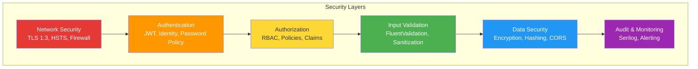
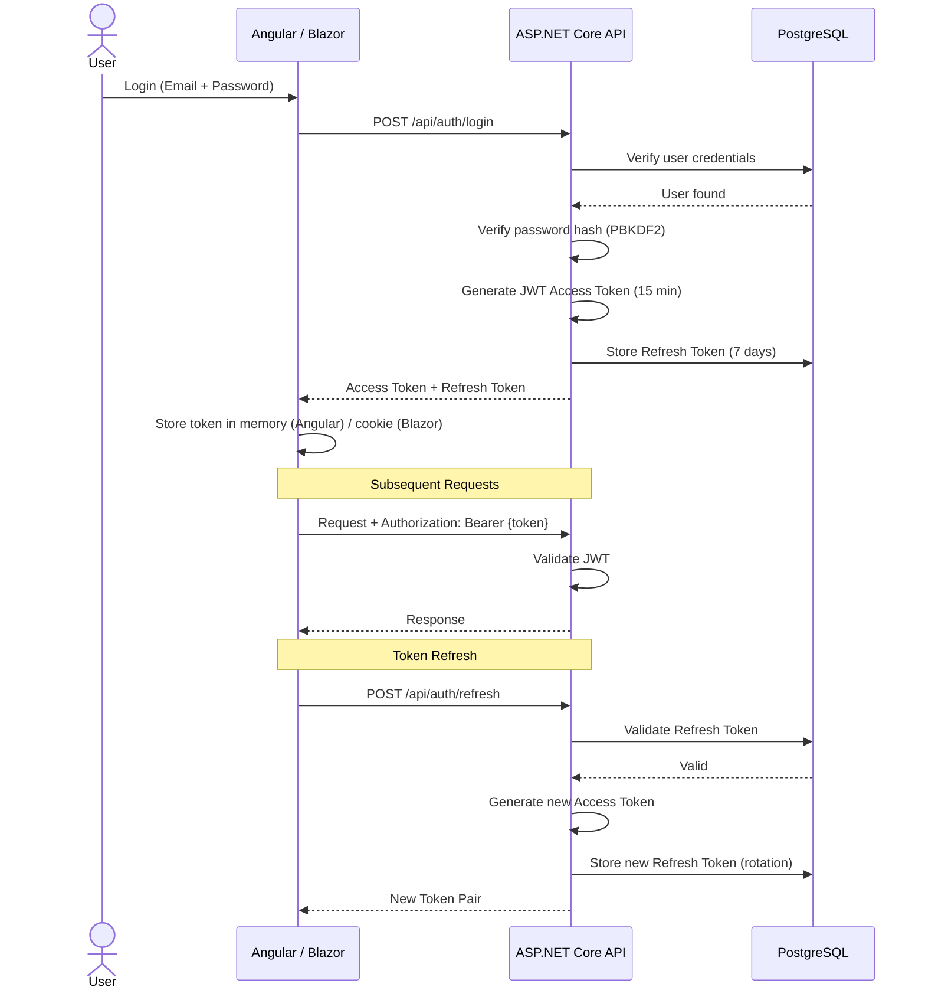
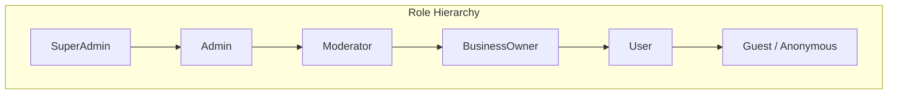
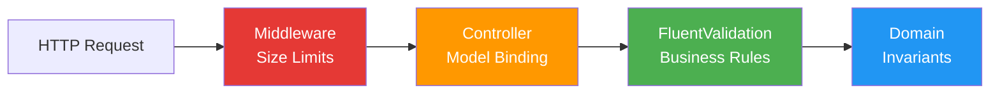

# 🔒 Security Concept – KurdMap

## 1. Security Overview



---

## 2. Authentication

### 2.1 JWT (JSON Web Token) Flow



### Technology Alternatives: Authentication

| Component | Chosen | Alternative 1 | Alternative 2 | Alternative 3 |
|-----------|--------|--------------|--------------|---------------|
| **Token Store** | PostgreSQL | Redis | IDistributedCache | In-Memory |
| **Token Format** | JWT (Access) + Opaque (Refresh) | JWT for both | Session-based | OAuth2 Tokens |
| **Identity Provider** | ASP.NET Core Identity | Keycloak | Auth0 | IdentityServer |
| **Password Hashing** | PBKDF2 (Identity default, 600k iterations) | Argon2id | bcrypt | scrypt |

### 2.2 JWT Configuration

```csharp
public sealed class JwtTokenService : IJwtTokenService
{
    private readonly JwtSettings _settings;
    private readonly TimeProvider _timeProvider;

    public JwtTokenService(IOptions<JwtSettings> settings, TimeProvider timeProvider)
    {
        _settings = settings.Value;
        _timeProvider = timeProvider;
    }

    public string GenerateAccessToken(ApplicationUser user, IList<string> roles)
    {
        var claims = new List<Claim>
        {
            new(JwtRegisteredClaimNames.Sub, user.Id.ToString()),
            new(JwtRegisteredClaimNames.Email, user.Email!),
            new(JwtRegisteredClaimNames.Jti, Guid.NewGuid().ToString()),
            new("fullName", user.FullName),
        };

        claims.AddRange(roles.Select(role => new Claim(ClaimTypes.Role, role)));

        var key = new SymmetricSecurityKey(
            Encoding.UTF8.GetBytes(_settings.Secret));
        var credentials = new SigningCredentials(key, SecurityAlgorithms.HmacSha512);

        var token = new JwtSecurityToken(
            issuer: _settings.Issuer,
            audience: _settings.Audience,
            claims: claims,
            notBefore: _timeProvider.GetUtcNow().UtcDateTime,
            expires: _timeProvider.GetUtcNow()
                .AddMinutes(_settings.AccessTokenExpirationMinutes).UtcDateTime,
            signingCredentials: credentials);

        return new JwtSecurityTokenHandler().WriteToken(token);
    }

    public string GenerateRefreshToken()
    {
        return Convert.ToBase64String(RandomNumberGenerator.GetBytes(64));
    }
}

public sealed class JwtSettings
{
    public required string Secret { get; init; }            // Min. 64 characters
    public required string Issuer { get; init; }
    public required string Audience { get; init; }
    public int AccessTokenExpirationMinutes { get; init; } = 15;
    public int RefreshTokenExpirationDays { get; init; } = 7;
}
```

---

## 3. Authorization

### 3.1 Role-Based Access Control (RBAC)



### 3.2 Permission Matrix

| Permission | SuperAdmin | Admin | Moderator | BusinessOwner | User | Guest |
|-----------|:----------:|:-----:|:---------:|:-------------:|:----:|:-----:|
| System configuration | ✅ | ❌ | ❌ | ❌ | ❌ | ❌ |
| Manage users | ✅ | ✅ | ❌ | ❌ | ❌ | ❌ |
| Manage categories | ✅ | ✅ | ❌ | ❌ | ❌ | ❌ |
| Create business | ✅ | ✅ | ✅ | ❌ | ❌ | ❌ |
| Verify business | ✅ | ✅ | ✅ | ❌ | ❌ | ❌ |
| Edit business | ✅ | ✅ | ✅ | ⚠️ | ❌ | ❌ |
| Delete business | ✅ | ✅ | ❌ | ❌ | ❌ | ❌ |
| Upload images | ✅ | ✅ | ✅ | ⚠️ | ❌ | ❌ |
| View all businesses | ✅ | ✅ | ✅ | ✅ | ✅ | ✅ |
| Search businesses | ✅ | ✅ | ✅ | ✅ | ✅ | ✅ |
| View business detail | ✅ | ✅ | ✅ | ✅ | ✅ | ✅ |
| Write reviews (Phase 2) | ✅ | ✅ | ✅ | ✅ | ✅ | ❌ |
| View admin dashboard | ✅ | ✅ | ✅ | ❌ | ❌ | ❌ |
| View audit log | ✅ | ✅ | ❌ | ❌ | ❌ | ❌ |

⚠️ = Only own business (ownership-based)

### 3.3 Policy-Based Authorization

```csharp
public static class AuthorizationPolicies
{
    public const string SuperAdminOnly = "SuperAdminOnly";
    public const string AdminOnly = "AdminOnly";
    public const string ModeratorOrAbove = "ModeratorOrAbove";
    public const string CanManageBusinesses = "CanManageBusinesses";
    public const string CanVerifyBusinesses = "CanVerifyBusinesses";
    public const string CanViewAuditLog = "CanViewAuditLog";
}

// Registration in Program.cs
builder.Services.AddAuthorization(options =>
{
    options.AddPolicy(AuthorizationPolicies.SuperAdminOnly, policy =>
        policy.RequireRole(Roles.SuperAdmin));

    options.AddPolicy(AuthorizationPolicies.AdminOnly, policy =>
        policy.RequireRole(Roles.SuperAdmin, Roles.Admin));

    options.AddPolicy(AuthorizationPolicies.ModeratorOrAbove, policy =>
        policy.RequireRole(Roles.SuperAdmin, Roles.Admin, Roles.Moderator));

    options.AddPolicy(AuthorizationPolicies.CanManageBusinesses, policy =>
        policy.RequireRole(Roles.SuperAdmin, Roles.Admin, Roles.Moderator));
});

// Usage in Controller
[HttpPost("{id}/verify")]
[Authorize(Policy = AuthorizationPolicies.CanVerifyBusinesses)]
public async Task<IActionResult> VerifyBusiness(Guid id, CancellationToken ct)
{
    await _sender.Send(new VerifyBusinessCommand(id), ct);
    return NoContent();
}
```

### 3.4 Resource-Based Authorization (Business Ownership)

```csharp
public class BusinessOwnerRequirement : IAuthorizationRequirement { }

public class BusinessOwnerHandler
    : AuthorizationHandler<BusinessOwnerRequirement, Business>
{
    protected override Task HandleRequirementAsync(
        AuthorizationHandlerContext context,
        BusinessOwnerRequirement requirement,
        Business business)
    {
        var userId = context.User.FindFirstValue(ClaimTypes.NameIdentifier);

        // Admins can always edit
        if (context.User.IsInRole(Roles.Admin) ||
            context.User.IsInRole(Roles.SuperAdmin))
        {
            context.Succeed(requirement);
            return Task.CompletedTask;
        }

        // Business owner can edit their own business
        if (business.OwnerId?.ToString() == userId)
        {
            context.Succeed(requirement);
        }

        return Task.CompletedTask;
    }
}
```

---

## 4. Input Validation & Protection

### 4.1 Validation Layers



### 4.2 OWASP Top 10 Mitigations

| Threat | Mitigation in KurdMap |
|--------|----------------------|
| **A01: Broken Access Control** | RBAC + Policy-based auth + Resource-based auth |
| **A02: Cryptographic Failures** | TLS 1.3, PBKDF2 password hashing, JWT with HMAC-SHA512 |
| **A03: Injection** | Parameterized queries (EF Core), FluentValidation, input sanitization |
| **A04: Insecure Design** | Clean Architecture, threat modeling, principle of least privilege |
| **A05: Security Misconfiguration** | Secure defaults, no debug in prod, security headers |
| **A06: Vulnerable Components** | Dependabot, `dotnet list package --vulnerable` |
| **A07: Auth Failures** | JWT with short expiry, refresh token rotation, rate limiting |
| **A08: Data Integrity** | CSRF protection, signed JWTs, Content-Security-Policy |
| **A09: Logging Failures** | Serilog structured logging, correlation IDs, no PII in logs |
| **A10: SSRF** | No user-controlled URLs for server-side requests, URL validation |

### 4.3 Security Headers

```csharp
// Middleware for security headers
app.Use(async (context, next) =>
{
    context.Response.Headers.Append("X-Content-Type-Options", "nosniff");
    context.Response.Headers.Append("X-Frame-Options", "DENY");
    context.Response.Headers.Append("X-XSS-Protection", "0");
    context.Response.Headers.Append("Referrer-Policy", "strict-origin-when-cross-origin");
    context.Response.Headers.Append("Permissions-Policy",
        "camera=(), microphone=(), geolocation=(self)");
    context.Response.Headers.Append("Content-Security-Policy",
        "default-src 'self'; " +
        "script-src 'self'; " +
        "style-src 'self' 'unsafe-inline'; " +
        "img-src 'self' data: https://*.tile.openstreetmap.org; " +
        "connect-src 'self'; " +
        "font-src 'self'; " +
        "frame-ancestors 'none';");

    await next();
});
```

---

## 5. CORS Configuration

```csharp
builder.Services.AddCors(options =>
{
    options.AddPolicy("KurdMapPolicy", policy =>
    {
        policy
            .WithOrigins(
                "https://kurdmap.de",           // Production frontend
                "https://admin.kurdmap.de",     // Production admin
                "http://localhost:4200",        // Angular dev
                "http://localhost:5001"         // Blazor dev
            )
            .AllowAnyMethod()
            .AllowAnyHeader()
            .AllowCredentials()
            .SetPreflightMaxAge(TimeSpan.FromMinutes(10));
    });
});
```

---

## 6. Rate Limiting

```csharp
builder.Services.AddRateLimiter(options =>
{
    // Global rate limit
    options.GlobalLimiter = PartitionedRateLimiter.Create<HttpContext, string>(
        context => RateLimitPartition.GetFixedWindowLimiter(
            partitionKey: context.Connection.RemoteIpAddress?.ToString() ?? "unknown",
            factory: _ => new FixedWindowRateLimiterOptions
            {
                PermitLimit = 100,
                Window = TimeSpan.FromMinutes(1),
                QueueLimit = 10
            }));

    // Auth endpoints — stricter limit
    options.AddFixedWindowLimiter("AuthLimit", limiter =>
    {
        limiter.PermitLimit = 5;
        limiter.Window = TimeSpan.FromMinutes(5);
        limiter.QueueLimit = 0;
    });

    // Search endpoints — generous limit
    options.AddSlidingWindowLimiter("SearchLimit", limiter =>
    {
        limiter.PermitLimit = 60;
        limiter.Window = TimeSpan.FromMinutes(1);
        limiter.SegmentsPerWindow = 6;
    });

    options.RejectionStatusCode = StatusCodes.Status429TooManyRequests;
});
```

---

## 7. Image Upload Security

```csharp
public class ImageService : IImageService
{
    private static readonly HashSet<string> AllowedExtensions = new(StringComparer.OrdinalIgnoreCase)
    {
        ".jpg", ".jpeg", ".png", ".webp"
    };

    private static readonly Dictionary<string, byte[]> ImageSignatures = new()
    {
        { ".jpg",  new byte[] { 0xFF, 0xD8, 0xFF } },
        { ".jpeg", new byte[] { 0xFF, 0xD8, 0xFF } },
        { ".png",  new byte[] { 0x89, 0x50, 0x4E, 0x47 } },
        { ".webp", new byte[] { 0x52, 0x49, 0x46, 0x46 } },
    };

    private const long MaxFileSize = 5 * 1024 * 1024; // 5 MB

    public async Task<Result<string>> UploadAsync(
        IFormFile file, CancellationToken ct)
    {
        // 1. Validate extension
        var extension = Path.GetExtension(file.FileName);
        if (!AllowedExtensions.Contains(extension))
            return Result<string>.Failure("File type not allowed");

        // 2. Validate size
        if (file.Length > MaxFileSize)
            return Result<string>.Failure("File exceeds 5 MB limit");

        // 3. Validate magic bytes (prevent disguised files)
        using var stream = file.OpenReadStream();
        var headerBytes = new byte[8];
        await stream.ReadExactlyAsync(headerBytes, ct);
        stream.Position = 0;

        var expectedSignature = ImageSignatures
            .GetValueOrDefault(extension.ToLowerInvariant());
        if (expectedSignature is null ||
            !headerBytes.AsSpan(0, expectedSignature.Length)
                .SequenceEqual(expectedSignature))
        {
            return Result<string>.Failure("File content does not match extension");
        }

        // 4. Generate safe filename (prevent path traversal)
        var safeFileName = $"{Guid.NewGuid()}{extension.ToLowerInvariant()}";
        var filePath = Path.Combine(_uploadPath, safeFileName);

        // 5. Save file
        await using var fileStream = new FileStream(filePath, FileMode.Create);
        await stream.CopyToAsync(fileStream, ct);

        return $"/uploads/{safeFileName}";
    }
}
```

---

## 8. Data Protection

### 8.1 Sensitive Data Handling

| Data Type | Protection | Storage |
|-----------|-----------|---------|
| Passwords | PBKDF2 (600k iterations) | Hashed in DB |
| JWT Secret | Environment variable | Never in code/config |
| Connection strings | Environment variable / Secret Manager | Never in git |
| User emails | Encrypted at rest (PostgreSQL TDE) | DB |
| Business data | No encryption needed (public data) | DB |
| Upload files | Virus scan (future), safe naming | File system |
| Refresh tokens | SHA-256 hashed before storage | DB |
| Audit logs | Immutable, no PII in messages | DB |

### 8.2 Environment Configuration

```csharp
// ❌ NEVER hardcode secrets
"ConnectionStrings": {
    "DefaultConnection": "Host=localhost;Database=kurdmap;Username=XXX;Password=XXX"
}

// ✅ Use environment variables
"ConnectionStrings": {
    "DefaultConnection": "${KURDMAP_DB_CONNECTION}"
}
```

```bash
# .env (never committed to git)
KURDMAP_DB_CONNECTION=Host=localhost;Database=kurdmap;Username=kurdmap_app;Password=<strong-password>
KURDMAP_JWT_SECRET=<64-character-random-string>
KURDMAP_JWT_ISSUER=https://api.kurdmap.de
KURDMAP_JWT_AUDIENCE=https://kurdmap.de
KURDMAP_REDIS_CONNECTION=localhost:6379
```
