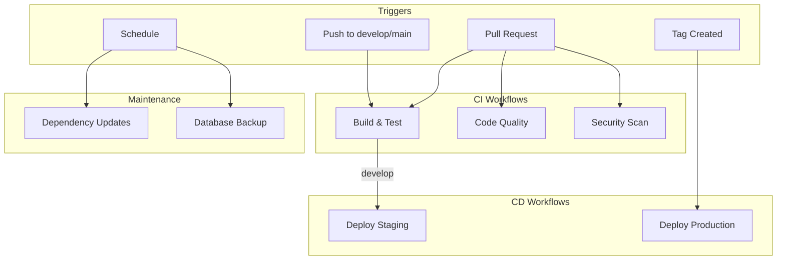
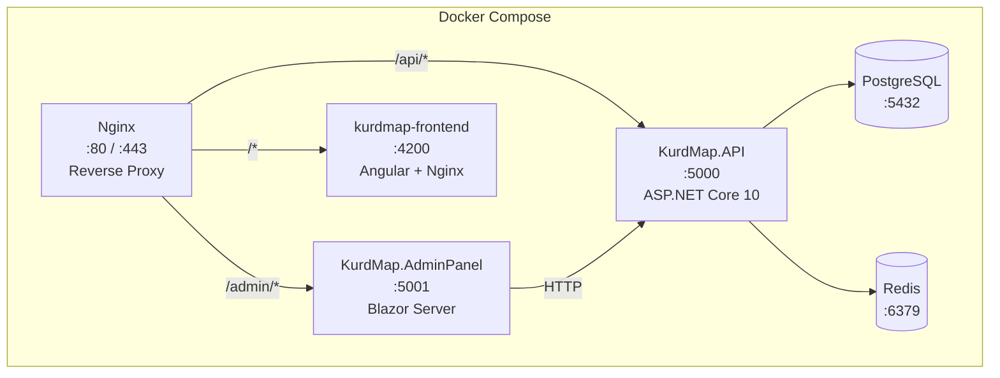
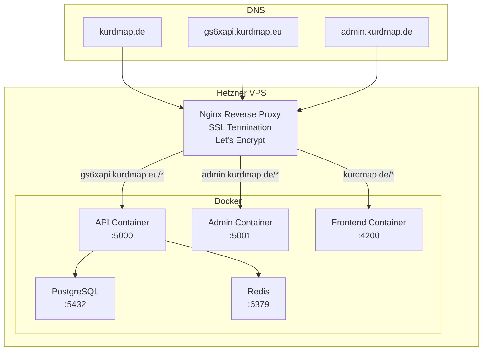

# 🚀 DevOps & CI/CD – KurdMap

## 1. DevOps Overview

```mermaid
graph LR
    subgraph "Development"
        CODE[Write Code]
        COMMIT[Git Commit]
        PR[Pull Request]
    end

    subgraph "CI – Continuous Integration"
        BUILD[Build]
        TEST[Run Tests]
        LINT[Code Analysis]
        SEC[Security Scan]
        ART[Create Artifacts]
    end

    subgraph "CD – Continuous Delivery"
        STAGE[Staging Deploy]
        E2E[E2E Tests]
        APPROVE[Approval]
        PROD[Production Deploy]
    end

    subgraph "Operations"
        MON[Monitoring]
        LOG[Logging]
        ALERT[Alerting]
    end

    CODE --> COMMIT --> PR --> BUILD --> TEST --> LINT --> SEC --> ART
    ART --> STAGE --> E2E --> APPROVE --> PROD
    PROD --> MON --> LOG --> ALERT
```



---

## 2. GitHub Actions – Pipeline Architecture

### 2.1 Workflow Overview



### 2.2 CI Pipeline: Build & Test

```yaml
# .github/workflows/ci.yml
name: CI – Build & Test

on:
  push:
    branches: [develop, main]
  pull_request:
    branches: [develop, main]

env:
  DOTNET_VERSION: '10.0.x'
  NODE_VERSION: '22.x'
  SOLUTION_PATH: 'KurdMap.sln'

jobs:
  build-api:
    name: Build & Test API
    runs-on: ubuntu-latest

    services:
      postgres:
        image: postgres:16
        env:
          POSTGRES_DB: kurdmap_test
          POSTGRES_USER: test
          POSTGRES_PASSWORD: test
        ports:
          - 5432:5432
        options: >-
          --health-cmd pg_isready
          --health-interval 10s
          --health-timeout 5s
          --health-retries 5

    steps:
      - name: Checkout
        uses: actions/checkout@v4

      - name: Setup .NET
        uses: actions/setup-dotnet@v4
        with:
          dotnet-version: ${{ env.DOTNET_VERSION }}

      - name: Restore NuGet cache
        uses: actions/cache@v4
        with:
          path: ~/.nuget/packages
          key: nuget-${{ runner.os }}-${{ hashFiles('**/*.csproj') }}
          restore-keys: nuget-${{ runner.os }}-

      - name: Restore dependencies
        run: dotnet restore ${{ env.SOLUTION_PATH }}

      - name: Build
        run: dotnet build ${{ env.SOLUTION_PATH }} --no-restore --configuration Release

      - name: Run unit tests
        run: dotnet test tests/KurdMap.Domain.Tests --no-build -c Release --logger trx

      - name: Run application tests
        run: dotnet test tests/KurdMap.Application.Tests --no-build -c Release --logger trx

      - name: Run integration tests
        run: dotnet test tests/KurdMap.API.Tests --no-build -c Release --logger trx
        env:
          ConnectionStrings__DefaultConnection: >-
            Host=localhost;Database=kurdmap_test;Username=test;Password=test

      - name: Upload test results
        uses: actions/upload-artifact@v4
        if: always()
        with:
          name: test-results
          path: '**/*.trx'

  build-frontend:
    name: Build & Test Frontend
    runs-on: ubuntu-latest

    steps:
      - name: Checkout
        uses: actions/checkout@v4

      - name: Setup Node.js
        uses: actions/setup-node@v4
        with:
          node-version: ${{ env.NODE_VERSION }}
          cache: 'npm'
          cache-dependency-path: src/kurdmap-frontend/package-lock.json

      - name: Install dependencies
        run: npm ci
        working-directory: src/kurdmap-frontend

      - name: Lint
        run: npm run lint
        working-directory: src/kurdmap-frontend

      - name: Build
        run: npm run build -- --configuration production
        working-directory: src/kurdmap-frontend

      - name: Run tests
        run: npm run test -- --no-watch --code-coverage
        working-directory: src/kurdmap-frontend

  security-scan:
    name: Security Scan
    runs-on: ubuntu-latest
    needs: [build-api]

    steps:
      - name: Checkout
        uses: actions/checkout@v4

      - name: Setup .NET
        uses: actions/setup-dotnet@v4
        with:
          dotnet-version: ${{ env.DOTNET_VERSION }}

      - name: Check vulnerable packages
        run: dotnet list ${{ env.SOLUTION_PATH }} package --vulnerable --include-transitive

      - name: Run CodeQL analysis
        uses: github/codeql-action/analyze@v3
        with:
          languages: csharp, javascript
```

---

## 3. Docker Configuration

### 3.1 Architecture



### 3.2 Docker Compose

```yaml
# docker/docker-compose.yml
version: '3.9'

services:
  postgres:
    image: postgres:16-alpine
    container_name: kurdmap-db
    environment:
      POSTGRES_DB: kurdmap
      POSTGRES_USER: ${DB_USER:-kurdmap_app}
      POSTGRES_PASSWORD: ${DB_PASSWORD}
    ports:
      - "5432:5432"
    volumes:
      - postgres_data:/var/lib/postgresql/data
    healthcheck:
      test: ["CMD-SHELL", "pg_isready -U ${DB_USER:-kurdmap_app}"]
      interval: 10s
      timeout: 5s
      retries: 5
    networks:
      - kurdmap-network

  redis:
    image: redis:7-alpine
    container_name: kurdmap-redis
    ports:
      - "6379:6379"
    volumes:
      - redis_data:/data
    healthcheck:
      test: ["CMD", "redis-cli", "ping"]
      interval: 10s
      timeout: 5s
      retries: 5
    networks:
      - kurdmap-network

  api:
    build:
      context: ..
      dockerfile: docker/Dockerfile.api
    container_name: kurdmap-api
    environment:
      - ASPNETCORE_ENVIRONMENT=Production
      - ConnectionStrings__DefaultConnection=Host=postgres;Database=kurdmap;Username=${DB_USER:-kurdmap_app};Password=${DB_PASSWORD}
      - ConnectionStrings__Redis=redis:6379
      - Jwt__Secret=${JWT_SECRET}
      - Jwt__Issuer=${JWT_ISSUER:-https://gs6xapi.kurdmap.eu}
      - Jwt__Audience=${JWT_AUDIENCE:-https://kurdmap.de}
    ports:
      - "5000:8080"
    depends_on:
      postgres:
        condition: service_healthy
      redis:
        condition: service_healthy
    networks:
      - kurdmap-network

  admin:
    build:
      context: ..
      dockerfile: docker/Dockerfile.admin
    container_name: kurdmap-admin
    environment:
      - ASPNETCORE_ENVIRONMENT=Production
      - ApiBaseUrl=http://api:8080
    ports:
      - "5001:8080"
    depends_on:
      - api
    networks:
      - kurdmap-network

  frontend:
    build:
      context: ..
      dockerfile: docker/Dockerfile.frontend
    container_name: kurdmap-frontend
    ports:
      - "4200:80"
    depends_on:
      - api
    networks:
      - kurdmap-network

  nginx:
    image: nginx:alpine
    container_name: kurdmap-proxy
    ports:
      - "80:80"
      - "443:443"
    volumes:
      - ./nginx/nginx.conf:/etc/nginx/nginx.conf:ro
      - ./nginx/ssl:/etc/nginx/ssl:ro
    depends_on:
      - api
      - admin
      - frontend
    networks:
      - kurdmap-network

volumes:
  postgres_data:
  redis_data:

networks:
  kurdmap-network:
    driver: bridge
```

### 3.3 Dockerfile – API

```dockerfile
# docker/Dockerfile.api
FROM mcr.microsoft.com/dotnet/sdk:10.0 AS build
WORKDIR /src

# Copy csproj files and restore
COPY src/KurdMap.Domain/KurdMap.Domain.csproj src/KurdMap.Domain/
COPY src/KurdMap.Application/KurdMap.Application.csproj src/KurdMap.Application/
COPY src/KurdMap.Infrastructure/KurdMap.Infrastructure.csproj src/KurdMap.Infrastructure/
COPY src/KurdMap.Shared/KurdMap.Shared.csproj src/KurdMap.Shared/
COPY src/KurdMap.API/KurdMap.API.csproj src/KurdMap.API/
RUN dotnet restore src/KurdMap.API/KurdMap.API.csproj

# Copy everything and build
COPY src/ src/
RUN dotnet publish src/KurdMap.API/KurdMap.API.csproj \
    -c Release -o /app/publish --no-restore

# Runtime
FROM mcr.microsoft.com/dotnet/aspnet:10.0 AS runtime
WORKDIR /app
COPY --from=build /app/publish .

# Security: non-root user
RUN adduser --disabled-password --gecos '' appuser
USER appuser

EXPOSE 8080
ENTRYPOINT ["dotnet", "KurdMap.API.dll"]
```

### 3.4 Dockerfile – Frontend

```dockerfile
# docker/Dockerfile.frontend
FROM node:22-alpine AS build
WORKDIR /app

COPY src/kurdmap-frontend/package*.json ./
RUN npm ci

COPY src/kurdmap-frontend/ .
RUN npm run build -- --configuration production

# Serve with Nginx
FROM nginx:alpine
COPY --from=build /app/dist/kurdmap-frontend/browser /usr/share/nginx/html
COPY docker/nginx/frontend.conf /etc/nginx/conf.d/default.conf

EXPOSE 80
```

---

## 4. Deployment Architecture



### 4.1 Nginx Configuration

```nginx
# Main site — Angular frontend
server {
    listen 443 ssl http2;
    server_name kurdmap.de www.kurdmap.de;

    ssl_certificate /etc/letsencrypt/live/kurdmap.de/fullchain.pem;
    ssl_certificate_key /etc/letsencrypt/live/kurdmap.de/privkey.pem;

    # Security headers
    add_header X-Content-Type-Options nosniff;
    add_header X-Frame-Options DENY;
    add_header Strict-Transport-Security "max-age=31536000; includeSubDomains" always;

    location / {
        proxy_pass http://frontend:80;
    }
}

# API
server {
    listen 443 ssl http2;
    server_name gs6xapi.kurdmap.eu;

    ssl_certificate /etc/letsencrypt/live/kurdmap.de/fullchain.pem;
    ssl_certificate_key /etc/letsencrypt/live/kurdmap.de/privkey.pem;

    location / {
        proxy_pass http://api:8080;
        proxy_set_header Host $host;
        proxy_set_header X-Real-IP $remote_addr;
        proxy_set_header X-Forwarded-For $proxy_add_x_forwarded_for;
        proxy_set_header X-Forwarded-Proto $scheme;

        # Rate limiting
        limit_req zone=api burst=20 nodelay;
    }
}

# Admin panel
server {
    listen 443 ssl http2;
    server_name admin.kurdmap.de;

    ssl_certificate /etc/letsencrypt/live/kurdmap.de/fullchain.pem;
    ssl_certificate_key /etc/letsencrypt/live/kurdmap.de/privkey.pem;

    # IP whitelist (optional — restrict admin access)
    # allow 1.2.3.4;
    # deny all;

    location / {
        proxy_pass http://admin:8080;
        proxy_set_header Host $host;
        proxy_http_version 1.1;
        proxy_set_header Upgrade $http_upgrade;
        proxy_set_header Connection "upgrade";  # SignalR WebSocket
    }
}
```

---

## 5. Monitoring & Logging

### 5.1 Logging Architecture

```mermaid
graph LR
    subgraph "Application"
        API[ASP.NET Core API]
        ADMIN[Blazor Admin]
    end

    subgraph "Logging"
        SERI[Serilog]
        CONSOLE[Console Sink]
        FILE[File Sink<br/>Rolling Daily]
        SEQ[Seq / Loki<br/>(Future)]
    end

    API --> SERI
    ADMIN --> SERI
    SERI --> CONSOLE
    SERI --> FILE
    SERI -.-> SEQ
```

### 5.2 Serilog Configuration

```csharp
// Program.cs
builder.Host.UseSerilog((context, config) =>
{
    config
        .ReadFrom.Configuration(context.Configuration)
        .Enrich.FromLogContext()
        .Enrich.WithMachineName()
        .Enrich.WithEnvironmentName()
        .Enrich.WithProperty("Application", "KurdMap.API")
        .WriteTo.Console(
            outputTemplate: "[{Timestamp:HH:mm:ss} {Level:u3}] " +
                          "{CorrelationId} {Message:lj}{NewLine}{Exception}")
        .WriteTo.File(
            path: "logs/kurdmap-.log",
            rollingInterval: RollingInterval.Day,
            retainedFileCountLimit: 30,
            outputTemplate: "{Timestamp:yyyy-MM-dd HH:mm:ss.fff zzz} " +
                          "[{Level:u3}] {CorrelationId} {Message:lj}{NewLine}{Exception}");
});
```

### 5.3 Health Checks

```csharp
builder.Services.AddHealthChecks()
    .AddNpgSql(connectionString, name: "postgresql")
    .AddRedis(redisConnection, name: "redis")
    .AddCheck("self", () => HealthCheckResult.Healthy());

app.MapHealthChecks("/health", new HealthCheckOptions
{
    ResponseWriter = UIResponseWriter.WriteHealthCheckUIResponse
});

app.MapHealthChecks("/health/ready", new HealthCheckOptions
{
    Predicate = check => check.Tags.Contains("ready")
});

app.MapHealthChecks("/health/live", new HealthCheckOptions
{
    Predicate = _ => false  // Just returns 200 if app is running
});
```
