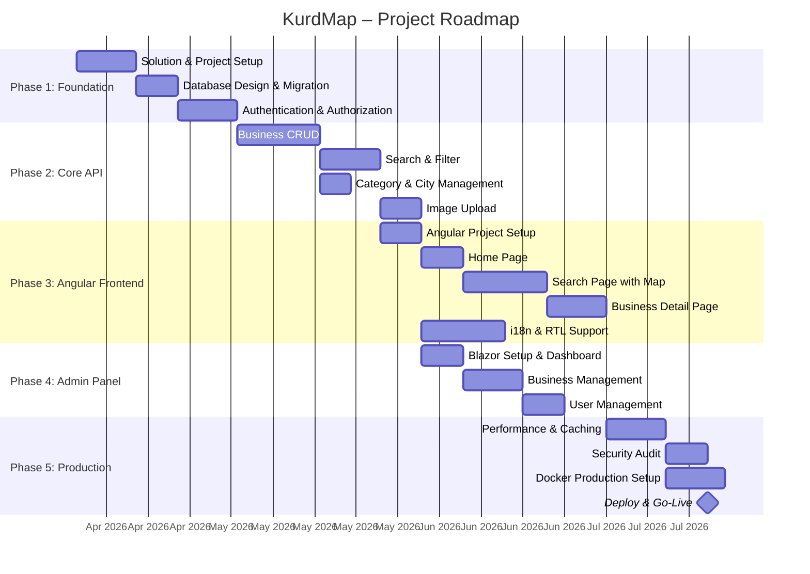
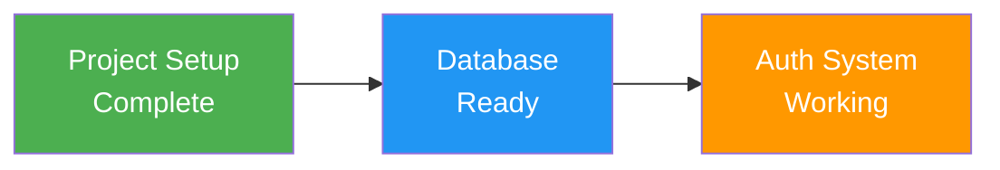
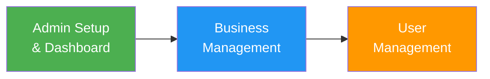
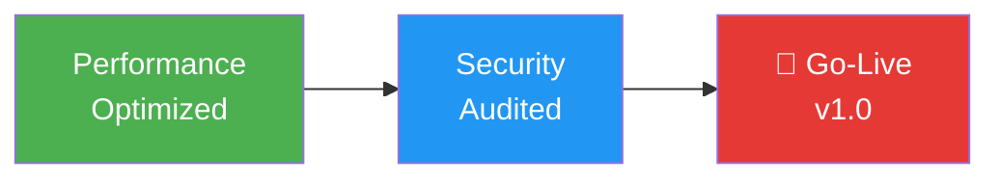

# 🗺️ Project Roadmap – KurdMap

## Overview

---

## Phase 1: Foundation (Weeks 1–4)

### Goal
Stable project base with Clean Architecture, database, and authentication system.

### Milestones

### Story 1.1: ASP.NET Core Solution Setup

| Detail | Description |
|--------|------------|
| **Description** | Set up Clean Architecture solution structure |
| **Acceptance Criteria** | Solution with Domain, Application, Infrastructure, API, Shared, AdminPanel projects |
| **Dependencies** | None |
| **Estimated Effort** | 5 days |

**Tasks:**
- [x] Create solution structure (7 projects)
- [x] Configure NuGet packages (MediatR, FluentValidation, EF Core, Serilog, Mapster)
- [x] Dependency Injection registrations per layer
- [x] Base middleware (Exception Handling, Logging, Correlation ID)
- [x] Swagger/OpenAPI configuration
- [x] `.editorconfig` and code style rules
- [x] Docker configuration (Dockerfile + docker-compose)
- [x] GitHub repository with branch protection rules
- [x] Initial README.md

### Story 1.2: Database Setup

| Detail | Description |
|--------|------------|
| **Description** | PostgreSQL database with EF Core configuration |
| **Acceptance Criteria** | All entities as tables, migrations functional, seed data applied |
| **Dependencies** | Story 1.1 |
| **Estimated Effort** | 4 days |

**Tasks:**
- [x] Entity classes defined (Business, Category, City, User, BusinessImage, BusinessService, MenuItem)
- [x] Value Objects (Address, Coordinates, MultilingualText, OpeningHours)
- [x] EF Core Configurations (Fluent API, separate files per entity)
- [ ] Initial migration, auto-apply on startup
- [x] Seed data: Categories (9), Cities (Köln, Düsseldorf), Admin user
- [x] Repository pattern implementation
- [x] Unit of Work implementation
- [x] Audit interceptor (CreatedAt, UpdatedAt)
- [ ] Soft-delete interceptor (Status column)

### Story 1.3: Authentication & Authorization

| Detail | Description |
|--------|------------|
| **Description** | JWT-based authentication and RBAC |
| **Acceptance Criteria** | Login, Register, Token Refresh, Role-based access control |
| **Dependencies** | Story 1.2 |
| **Estimated Effort** | 5 days |

**Tasks:**
- [x] ASP.NET Core Identity configuration with PostgreSQL
- [x] JWT Token generation (Access + Refresh Token)
- [x] Login endpoint (`POST /api/auth/login`)
- [x] Registration endpoint (`POST /api/auth/register`)
- [x] Token refresh endpoint (`POST /api/auth/refresh`)
- [x] Roles defined (SuperAdmin, Admin, Moderator, BusinessOwner, User)
- [ ] Seed one user per role
- [ ] Policy-based authorization
- [ ] Rate limiting on auth endpoints
- [ ] Unit tests for token service

---

## Phase 2: Core Backend API (Weeks 5–8)

### Goal
Complete CRUD operations for businesses with search, filtering, and image management.

### Milestones

### Story 2.1: Business CRUD

| Detail | Description |
|--------|------------|
| **Description** | Full business management via API |
| **Acceptance Criteria** | Create, Read, Update, Soft-Delete businesses via REST API |
| **Dependencies** | Story 1.3 |
| **Estimated Effort** | 7 days |

**Tasks:**
- [x] Business entity with Factory Method `Create()`
- [x] Slug generator service (German name → URL-friendly slug)
- [x] CreateBusinessCommand + Handler + Validator
- [x] UpdateBusinessCommand + Handler + Validator
- [x] DeleteBusinessCommand + Handler (soft delete → status change)
- [x] VerifyBusinessCommand + Handler
- [x] GetBusinessBySlugQuery + Handler
- [x] GetBusinessesListQuery + Handler (paginated)
- [x] BusinessCreatedEvent + Handler
- [x] BusinessesController (full REST API)
- [x] FluentValidation rules
- [ ] Unit tests for all commands and queries
- [ ] Integration tests (WebApplicationFactory + PostgreSQL)

### Story 2.2: Business Search & Filter

| Detail | Description |
|--------|------------|
| **Description** | Advanced search with full-text search, city and category filtering |
| **Acceptance Criteria** | Paginated search with text, city, category filters, sorted by relevance |
| **Dependencies** | Story 2.1 |
| **Estimated Effort** | 5 days |

**Tasks:**
- [x] SearchBusinessesQuery with dynamic IQueryable filtering
- [x] PostgreSQL full-text search (GIN index on multilingual name columns)
- [x] Filter by city slug
- [x] Filter by category slug
- [x] Sort by: relevance, name, newest, verified-first
- [x] Pagination with total count
- [x] Cache search results (Redis, 5 min TTL)
- [x] `GET /api/businesses?search=&city=&category=&page=&pageSize=&sort=`
- [ ] Unit tests

### Story 2.3: Category & City Management

| Detail | Description |
|--------|------------|
| **Description** | API endpoints for categories and cities |
| **Acceptance Criteria** | List all categories, list all cities, admin can manage |
| **Dependencies** | Story 2.1 |
| **Estimated Effort** | 3 days |

**Tasks:**
- [x] GetCategoriesQuery + Handler (cached)
- [x] GetCitiesQuery + Handler (cached)
- [x] CategoriesController (`GET /api/categories`)
- [x] CitiesController (`GET /api/cities`)
- [x] Admin: CreateCategory, UpdateCategory commands
- [ ] Unit tests

### Story 2.4: Image Upload & Management

| Detail | Description |
|--------|------------|
| **Description** | Business image upload with security validation |
| **Acceptance Criteria** | Upload JPG/PNG/WebP, max 5MB, magic bytes validation, safe naming |
| **Dependencies** | Story 2.1 |
| **Estimated Effort** | 4 days |

**Tasks:**
- [x] ImageService with security validation (extension, size, magic bytes)
- [x] Safe file naming (GUID-based, prevent path traversal)
- [x] UploadBusinessImageCommand + Handler
- [x] DeleteBusinessImageCommand + Handler
- [x] SetPrimaryImageCommand + Handler
- [x] ImagesController (`POST /api/businesses/{id}/images`)
- [x] Static file serving configuration
- [ ] Unit tests

---

## Phase 3: Angular Frontend (Weeks 9–13)

### Goal
Public-facing website with search, map, business details, and multilingual support.

### Milestones

### Story 3.1: Angular Project Setup

| Detail | Description |
|--------|------------|
| **Description** | Angular 19+ project with SSR, Tailwind, i18n, RTL |
| **Acceptance Criteria** | Project builds, SSR works, 4 languages configured, RTL working |
| **Dependencies** | Story 2.2 (API must be ready) |
| **Estimated Effort** | 5 days |

**Tasks:**
- [x] Angular 19+ project creation with SSR
- [x] Tailwind CSS configuration
- [x] i18n setup: Kurdish (Sorani), Kurdish (Kurmanji), German, English
- [x] RTL layout support (dir=rtl for Kurdish)
- [x] Environment configuration (API URL)
- [x] HTTP interceptors (auth, error handling)
- [x] Core services (BusinessService, CategoryService, CityService)
- [x] Shared components (Header, Footer, LanguageSwitcher)
- [x] App routing with lazy loading

### Story 3.2: Home Page

| Detail | Description |
|--------|------------|
| **Description** | Landing page with hero section, categories, and search |
| **Acceptance Criteria** | Hero with search bar, category cards, featured businesses |
| **Dependencies** | Story 3.1 |
| **Estimated Effort** | 4 days |

**Tasks:**
- [x] Hero section with background image and search bar
- [x] Category cards with icons
- [x] City selector (Köln / Düsseldorf)
- [x] Featured/verified businesses section
- [x] Responsive design (mobile-first)
- [x] Loading skeletons
- [x] SEO meta tags

### Story 3.3: Search Page with Map

| Detail | Description |
|--------|------------|
| **Description** | Search results with filters, grid, and interactive map |
| **Acceptance Criteria** | Search bar, category/city filters, results as cards, Leaflet map with markers |
| **Dependencies** | Story 3.2 |
| **Estimated Effort** | 7 days |

**Tasks:**
- [x] Search bar with debounced input
- [x] Category filter chips
- [x] City selector
- [x] Results grid (responsive card layout)
- [x] Leaflet map with business markers
- [x] Click marker → show business card popup
- [x] Pagination
- [x] URL sync (filters reflected in URL query params)
- [x] Loading skeletons
- [x] Empty state / no results

### Story 3.4: Business Detail Page

| Detail | Description |
|--------|------------|
| **Description** | Full business profile page |
| **Acceptance Criteria** | Image carousel, info, map, menu/services, opening hours, SEO |
| **Dependencies** | Story 3.3 |
| **Estimated Effort** | 5 days |

**Tasks:**
- [x] Hero section with image carousel
- [x] Business name, category badge, verified badge
- [x] Address with "Open in Maps" link
- [x] Opening hours (highlight current day, show open/closed status)
- [x] Menu section (expandable cards with prices)
- [x] Services section
- [x] Contact info (phone, email, website links)
- [x] Location map with single marker
- [x] Share buttons (WhatsApp, Telegram, copy link)
- [x] Breadcrumb navigation
- [x] SSR meta tags for SEO

### Story 3.5: i18n & RTL Polish

| Detail | Description |
|--------|------------|
| **Description** | Complete multilingual support with proper RTL layout |
| **Acceptance Criteria** | All UI text translated, RTL layout correct for Kurdish |
| **Dependencies** | Story 3.1 |
| **Estimated Effort** | 5 days |

**Tasks:**
- [x] Translation files for all 4 languages
- [x] Language switcher with flag icons
- [x] RTL/LTR layout switching
- [x] RTL-aware Tailwind classes
- [x] Test all pages in RTL mode
- [x] Font selection (Kurdish/Arabic font for RTL)
- [x] Browser language auto-detection

---

## Phase 4: Blazor Admin Panel (Weeks 14–17)

### Goal
Admin dashboard with full business and user management.

### Milestones

### Story 4.1: Blazor Setup & Dashboard

| Detail | Description |
|--------|------------|
| **Description** | Admin panel with MudBlazor, auth, and dashboard |
| **Acceptance Criteria** | Protected admin area, login page, dashboard with statistics |
| **Dependencies** | Story 2.1 |
| **Estimated Effort** | 4 days |

**Tasks:**
- [x] Blazor Server project with MudBlazor
- [x] JWT authentication via API
- [x] AuthenticationStateProvider
- [x] Admin layout with sidebar navigation
- [x] Dashboard page with statistics:
  - Total businesses (active, pending, rejected)
  - Total users per role
  - Businesses per city / category (charts)
  - Recent business registrations
- [x] Access restriction (Admin/Moderator policy)

### Story 4.2: Business Management

| Detail | Description |
|--------|------------|
| **Description** | Full CRUD for businesses in admin panel |
| **Acceptance Criteria** | List, create, edit, verify, deactivate, delete businesses |
| **Dependencies** | Story 4.1 |
| **Estimated Effort** | 5 days |

**Tasks:**
- [x] Business list (MudDataGrid: sortable, filterable, paginated)
- [x] Status indicators (Active=green, Pending=yellow, Rejected=red)
- [x] Quick actions: Verify, Deactivate, Edit, Delete
- [x] Create/Edit form dialog:
  - nur lingual input tab ( German)
  - Category and city selectors
  - Address and coordinates fields
  - Opening hours editor
  - Contact fields
- [x] Image upload with preview
- [x] Confirmation dialogs for destructive actions

### Story 4.3: User Management

| Detail | Description |
|--------|------------|
| **Description** | User administration with role management |
| **Acceptance Criteria** | User list, role assignment, activate/deactivate |
| **Dependencies** | Story 4.1 |
| **Estimated Effort** | 3 days |

**Tasks:**
- [x] User list (MudDataGrid)
- [x] Role badge display
- [x] Change user role
- [x] Deactivate / reactivate user
- [x] User detail view

---

## Phase 5: Production (Weeks 18–20)

### Goal
Production-ready deployment with security, performance, and monitoring.

### Milestones

### Story 5.1: Performance & Caching

**Tasks:**
- [x] Redis caching for categories, cities, search results
- [x] EF Core query optimization (`.AsNoTracking()`, projections, includes)
- [x] Image optimization (WebP, thumbnails)
- [x] Angular lazy loading verification
- [x] Angular bundle size optimization
- [ ] Lighthouse audit (target: 90+ on all metrics)

### Story 5.2: Security Audit

**Tasks:**
- [x] OWASP Top 10 checklist review
- [x] Security headers configuration
- [x] Rate limiting on all endpoints
- [x] CORS policy review
- [x] Dependency vulnerability scan (`dotnet list package --vulnerable`)
- [x] Input validation review
- [x] JWT configuration review

### Story 5.3: Docker & Deployment

**Tasks:**
- [ ] Production Docker Compose configuration
- [ ] Nginx reverse proxy with SSL (Let's Encrypt)
- [ ] Hetzner VPS provisioning
- [ ] Domain DNS configuration (kurdmap.de, gs6xapi.kurdmap.eu, admin.kurdmap.de)
- [ ] Health check endpoints
- [ ] Serilog production logging (rolling files, structured)
- [ ] Database backup strategy (pg_dump cron job)
- [ ] Monitoring setup

---

## Phase 5.5: Discount & Recommended Businesses (Completed ✅)

### Goal
Full-stack discount and recommended businesses feature with admin control, covering all 4 parts.

### Story 5.5.1: Backend — Discount & Recommended API

**Tasks:**
- [x] Domain entity: `SetDiscount()`, `ClearDiscount()`, `HasActiveDiscount` computed property
- [x] EF Configuration: discount columns, multilingual description (4 languages, varchar 500)
- [x] DTOs: DiscountPercentage, DiscountDescription, HasActiveDiscount in Summary & Detail
- [x] CQRS Commands: `SetBusinessDiscountCommand`, `ClearBusinessDiscountCommand` with FluentValidation
- [x] CQRS Query: `GetRecommendedBusinessesQuery` with Redis cache (5 min)
- [x] Controller endpoints: POST/DELETE `{id}/discount` (Admin+), GET `recommended` (public)
- [x] Search sort boost: IsFeatured → HasActiveDiscount → IsVerified → CreatedAt
- [x] EF Migration: `AddBusinessDiscounts` (7 columns)
- [x] 14 new tests (8 domain + 6 handler) — **104 total backend tests**

### Story 5.5.2: Admin Panel — Discount Management

**Tasks:**
- [x] Models: discount fields in BusinessSummary/BusinessDetail, DiscountPayload interface
- [x] API Service: `setDiscount()`, `clearDiscount()`, `getRecommendedBusinesses()`
- [x] Business form dialog: 8th tab (Discount) with form fields, save/remove, active banner
- [x] Business list: discount column with badge showing percentage
- [x] Roadmap component: updated with discount phases and test counts
- [x] 4 new tests — **63 total admin tests**

### Story 5.5.3: Frontend — Discount Display

**Tasks:**
- [x] Models: discount fields, `DiscountedFirst` sort, `RecommendedBusinesses` interface
- [x] Service: `getRecommended(count)` method
- [x] Business card: rose discount badge with pricetag icon
- [x] Business detail: active discount banner (rose gradient)
- [x] Featured businesses component: rewritten to show both featured & discounted sections
- [x] i18n: discount keys in all 4 languages (ku, kmr, de, en)
- [x] 2 new tests — **29 total frontend tests**

### Story 5.5.4: Mobile — Discount Display

**Tasks:**
- [x] Types: discount fields, `DiscountedFirst` sort, `RecommendedBusinesses` interface
- [x] API: `getRecommended(count)` method
- [x] BusinessCard: rose discount badge with pricetag icon
- [x] Home screen: recommended query with discounted businesses section
- [x] i18n: discount keys in all 4 languages
- [x] **109 total mobile tests** (all passing, no regressions)

### Story 5.5.5: Security Audit — Discount Endpoints

**Tasks:**
- [x] Authorization: SetDiscount/ClearDiscount require `SuperAdmin,Admin` roles
- [x] GetRecommended: public access (correct)
- [x] FluentValidation: percentage 1-100, end date > start date
- [x] EF maxlength(500) on description columns
- [x] Parameterized EF Core queries (SQL injection safe)
- [x] Route ID match validation in controller

---

## Phase 6: Enhancements (Future)

> 📋 بینی [١٤-٣٠-ئایدیای-پێشکەوتوو](14-30-advanced-admin-ideas.md) بۆ ٣٠ ئایدیای تەواو

- [ ] Real-time Dashboard (SignalR)
- [ ] Advanced RBAC with custom roles
- [ ] Business Verification Workflow
- [ ] AI Content Moderation
- [ ] Business Owner Self-Portal
- [ ] Coupon & Discount Code System
- [ ] Event Listings (Kurdish cultural events)
- [ ] Real-time Chat (business ↔ user)
- [ ] Push Notifications
- [ ] Login Audit Trail
- [ ] CDN & Image Optimization (WebP/AVIF)
- [ ] Public API & Documentation
- [ ] iOS App (Apple App Store)
- [ ] Expand to Berlin, Hamburg, München
- [ ] Community Forum

---

## Milestone Summary

| # | Milestone | Target | Status |
|:--:|-----------|:------:|:------:|
| 1 | Solution & DB Setup | Week 2 | ✅ Completed |
| 2 | Auth System Working | Week 4 | ✅ Completed |
| 3 | API MVP (CRUD + Search) | Week 8 | ✅ Completed |
| 4 | Frontend MVP (Search + Detail) | Week 13 | ✅ Completed |
| 5 | Admin Panel MVP | Week 17 | ✅ Completed |
| 5.5 | Discount & Recommended | — | ✅ Completed |
| 6 | Production Deploy v1.0 | Week 20 | 🔲 Not Started |

---

## Test Summary

| Part | Tests | Status |
|------|:-----:|:------:|
| Backend (.NET) | 104 | ✅ |
| Admin (Angular/Vitest) | 63 | ✅ |
| Frontend (Angular/Vitest) | 29 | ✅ |
| Mobile (React Native/Jest) | 109 | ✅ |
| **Total** | **305** | ✅ |
