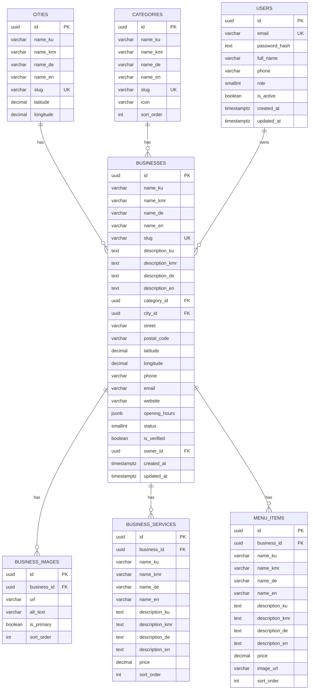

# 🗄️ Database Design – KurdMap (PostgreSQL)

## 1. Entity Relationship Diagram



---

## 2. Table Definitions

### 2.1 `businesses` (Main Table)

| Column | Type | Constraints | Description |
|--------|------|-------------|-------------|
| `id` | `uuid` | PK, DEFAULT `gen_random_uuid()` | Unique identifier |
| `name_ku` | `varchar(200)` | NOT NULL | Kurdish name (Sorani) |
| `name_kmr` | `varchar(200)` | | Kurdish name (Kurmanji) |
| `name_de` | `varchar(200)` | NOT NULL | German name |
| `name_en` | `varchar(200)` | | English name |
| `slug` | `varchar(250)` | UNIQUE, NOT NULL | URL-friendly identifier |
| `description_ku` | `text` | | Kurdish description (Sorani) |
| `description_kmr` | `text` | | Kurdish description (Kurmanji) |
| `description_de` | `text` | | German description |
| `description_en` | `text` | | English description |
| `category_id` | `uuid` | FK → `categories.id` | Business category |
| `city_id` | `uuid` | FK → `cities.id` | City location |
| `street` | `varchar(300)` | NOT NULL | Street address |
| `postal_code` | `varchar(10)` | NOT NULL | Postal code |
| `latitude` | `decimal(10,7)` | NOT NULL | GPS latitude |
| `longitude` | `decimal(10,7)` | NOT NULL | GPS longitude |
| `phone` | `varchar(20)` | | Contact phone |
| `email` | `varchar(200)` | | Contact email |
| `website` | `varchar(500)` | | Website URL |
| `opening_hours` | `jsonb` | | Weekly schedule (JSON) |
| `status` | `smallint` | NOT NULL, DEFAULT 0 | 0=Pending, 1=Active, 2=Rejected, 3=Deactivated |
| `is_verified` | `boolean` | NOT NULL, DEFAULT false | Admin-verified flag |
| `owner_id` | `uuid` | FK → `users.id`, NULLABLE | Business owner |
| `created_at` | `timestamptz` | NOT NULL, DEFAULT `now()` | Creation timestamp |
| `updated_at` | `timestamptz` | NOT NULL, DEFAULT `now()` | Last update |

**Indexes:**

| Index Name | Columns | Type | Purpose |
|-----------|---------|------|---------|
| `ix_businesses_slug` | `slug` | UNIQUE B-Tree | Slug lookup |
| `ix_businesses_city_category` | `city_id`, `category_id` | B-Tree | Filter queries |
| `ix_businesses_status` | `status` | B-Tree | Active business filter |
| `ix_businesses_owner` | `owner_id` | B-Tree | Owner's businesses |
| `ix_businesses_search` | `name_ku`, `name_kmr`, `name_de`, `name_en` | GIN (tsvector) | Full-text search |

### 2.2 `categories`

| Column | Type | Constraints |
|--------|------|-------------|
| `id` | `uuid` | PK, DEFAULT `gen_random_uuid()` |
| `name_ku` | `varchar(100)` | NOT NULL |
| `name_kmr` | `varchar(100)` | |
| `name_de` | `varchar(100)` | NOT NULL |
| `name_en` | `varchar(100)` | NOT NULL |
| `slug` | `varchar(120)` | UNIQUE, NOT NULL |
| `icon` | `varchar(50)` | Emoji or icon class |
| `sort_order` | `int` | NOT NULL, DEFAULT 0 |

### 2.3 `cities`

| Column | Type | Constraints |
|--------|------|-------------|
| `id` | `uuid` | PK, DEFAULT `gen_random_uuid()` |
| `name_ku` | `varchar(100)` | NOT NULL |
| `name_kmr` | `varchar(100)` | |
| `name_de` | `varchar(100)` | NOT NULL |
| `name_en` | `varchar(100)` | NOT NULL |
| `slug` | `varchar(120)` | UNIQUE, NOT NULL |
| `latitude` | `decimal(10,7)` | NOT NULL |
| `longitude` | `decimal(10,7)` | NOT NULL |

### 2.4 `business_images`

| Column | Type | Constraints |
|--------|------|-------------|
| `id` | `uuid` | PK |
| `business_id` | `uuid` | FK → `businesses.id`, ON DELETE CASCADE |
| `url` | `varchar(500)` | NOT NULL |
| `alt_text` | `varchar(200)` | |
| `is_primary` | `boolean` | NOT NULL, DEFAULT false |
| `sort_order` | `int` | NOT NULL, DEFAULT 0 |

### 2.5 `business_services`

| Column | Type | Constraints |
|--------|------|-------------|
| `id` | `uuid` | PK |
| `business_id` | `uuid` | FK → `businesses.id`, ON DELETE CASCADE |
| `name_ku` | `varchar(200)` | NOT NULL |
| `name_kmr` | `varchar(200)` | |
| `name_de` | `varchar(200)` | NOT NULL |
| `name_en` | `varchar(200)` | |
| `description_ku` | `text` | |
| `description_kmr` | `text` | |
| `description_de` | `text` | |
| `description_en` | `text` | |
| `price` | `decimal(10,2)` | |
| `sort_order` | `int` | NOT NULL, DEFAULT 0 |

### 2.6 `menu_items`

| Column | Type | Constraints |
|--------|------|-------------|
| `id` | `uuid` | PK |
| `business_id` | `uuid` | FK → `businesses.id`, ON DELETE CASCADE |
| `name_ku` | `varchar(200)` | NOT NULL |
| `name_kmr` | `varchar(200)` | |
| `name_de` | `varchar(200)` | NOT NULL |
| `name_en` | `varchar(200)` | |
| `description_ku` | `text` | |
| `description_kmr` | `text` | |
| `description_de` | `text` | |
| `description_en` | `text` | |
| `price` | `decimal(10,2)` | |
| `image_url` | `varchar(500)` | |
| `sort_order` | `int` | NOT NULL, DEFAULT 0 |

### 2.7 `users` (Extended ASP.NET Identity)

| Column | Type | Constraints |
|--------|------|-------------|
| `id` | `uuid` | PK |
| `email` | `varchar(256)` | UNIQUE, NOT NULL |
| `password_hash` | `text` | NOT NULL |
| `full_name` | `varchar(200)` | NOT NULL |
| `phone` | `varchar(20)` | |
| `role` | `smallint` | NOT NULL, DEFAULT 0 |
| `is_active` | `boolean` | NOT NULL, DEFAULT true |
| `created_at` | `timestamptz` | NOT NULL, DEFAULT `now()` |
| `updated_at` | `timestamptz` | NOT NULL, DEFAULT `now()` |

---

## 3. EF Core Configuration Example

```csharp
public class BusinessConfiguration : IEntityTypeConfiguration<Business>
{
    public void Configure(EntityTypeBuilder<Business> builder)
    {
        builder.ToTable("businesses");

        builder.HasKey(b => b.Id);

        // Multilingual Name (owned type)
        builder.OwnsOne(b => b.Name, name =>
        {
            name.Property(n => n.Ku).HasColumnName("name_ku").HasMaxLength(200).IsRequired();
            name.Property(n => n.Kmr).HasColumnName("name_kmr").HasMaxLength(200);
            name.Property(n => n.De).HasColumnName("name_de").HasMaxLength(200).IsRequired();
            name.Property(n => n.En).HasColumnName("name_en").HasMaxLength(200);
        });

        // Multilingual Description (owned type)
        builder.OwnsOne(b => b.Description, desc =>
        {
            desc.Property(d => d.Ku).HasColumnName("description_ku");
            desc.Property(d => d.Kmr).HasColumnName("description_kmr");
            desc.Property(d => d.De).HasColumnName("description_de");
            desc.Property(d => d.En).HasColumnName("description_en");
        });

        builder.Property(b => b.Slug).HasMaxLength(250).IsRequired();
        builder.HasIndex(b => b.Slug).IsUnique();

        // Address (owned type)
        builder.OwnsOne(b => b.Address, address =>
        {
            address.Property(a => a.Street).HasColumnName("street").HasMaxLength(300).IsRequired();
            address.Property(a => a.PostalCode).HasColumnName("postal_code").HasMaxLength(10).IsRequired();
            address.Property(a => a.CityId).HasColumnName("city_id");
        });

        // Coordinates (owned type)
        builder.OwnsOne(b => b.Location, loc =>
        {
            loc.Property(l => l.Latitude).HasColumnName("latitude").HasPrecision(10, 7).IsRequired();
            loc.Property(l => l.Longitude).HasColumnName("longitude").HasPrecision(10, 7).IsRequired();
        });

        builder.Property(b => b.Phone).HasMaxLength(20);
        builder.Property(b => b.Email).HasMaxLength(200);
        builder.Property(b => b.Website).HasMaxLength(500);

        builder.Property(b => b.Hours)
            .HasColumnName("opening_hours")
            .HasColumnType("jsonb");

        builder.Property(b => b.Status)
            .HasDefaultValue(BusinessStatus.Pending);

        builder.Property(b => b.IsVerified)
            .HasDefaultValue(false);

        // Relationships
        builder.HasOne<Category>()
            .WithMany()
            .HasForeignKey(b => b.CategoryId);

        builder.HasOne<ApplicationUser>()
            .WithMany()
            .HasForeignKey(b => b.OwnerId)
            .IsRequired(false);

        builder.HasMany(b => b.Images)
            .WithOne()
            .HasForeignKey(i => i.BusinessId)
            .OnDelete(DeleteBehavior.Cascade);

        builder.HasMany(b => b.Services)
            .WithOne()
            .HasForeignKey(s => s.BusinessId)
            .OnDelete(DeleteBehavior.Cascade);

        builder.HasMany(b => b.MenuItems)
            .WithOne()
            .HasForeignKey(m => m.BusinessId)
            .OnDelete(DeleteBehavior.Cascade);

        // Composite index
        builder.HasIndex(b => new { b.CategoryId })
            .HasDatabaseName("ix_businesses_city_category");

        builder.HasIndex(b => b.Status)
            .HasDatabaseName("ix_businesses_status");
    }
}
```

---

## 4. Full-Text Search Configuration

```csharp
// In migration or raw SQL
migrationBuilder.Sql(@"
    CREATE INDEX ix_businesses_search 
    ON businesses 
    USING GIN (
        to_tsvector('simple', 
            COALESCE(name_ku, '') || ' ' || 
            COALESCE(name_kmr, '') || ' ' || 
            COALESCE(name_de, '') || ' ' || 
            COALESCE(name_en, ''))
    );
");

// Usage in query
public async Task<PaginatedList<Business>> FullTextSearchAsync(
    string searchTerm, CancellationToken ct)
{
    return await _context.Businesses
        .Where(b => EF.Functions.ToTsVector("simple",
            b.Name.Ku + " " + b.Name.Kmr + " " + b.Name.De + " " + b.Name.En)
            .Matches(EF.Functions.PlainToTsQuery("simple", searchTerm)))
        .ToListAsync(ct);
}
```

---

## 5. Opening Hours JSON Structure

```json
{
  "monday":    { "open": "09:00", "close": "22:00", "closed": false },
  "tuesday":   { "open": "09:00", "close": "22:00", "closed": false },
  "wednesday": { "open": "09:00", "close": "22:00", "closed": false },
  "thursday":  { "open": "09:00", "close": "22:00", "closed": false },
  "friday":    { "open": "09:00", "close": "23:00", "closed": false },
  "saturday":  { "open": "10:00", "close": "23:00", "closed": false },
  "sunday":    { "open": null,    "close": null,    "closed": true  }
}
```

---

## 6. Seed Data

### 6.1 Categories

| Slug | Name (Kurdish) | Name (German) | Name (English) | Icon |
|------|---------------|---------------|----------------|------|
| `restaurant` | چێشتخانە و کافێ | Restaurant & Café | Restaurant & Café | 🍽️ |
| `barbershop` | دەلاک و سالۆن | Friseur & Salon | Barbershop & Salon | ✂️ |
| `hotel` | هۆتێل و نوێنگا | Hotel & Unterkunft | Hotel & Accommodation | 🏨 |
| `grocery` | سوپەرمارکێت | Supermarkt & Lebensmittel | Grocery & Supermarket | 🛒 |
| `travel` | ئاژانسی گەشتوگوزار | Reisebüro | Travel Agency | ✈️ |
| `legal` | یاسایی و وەرگێڕان | Recht & Übersetzung | Legal & Translation | ⚖️ |
| `medical` | تەندروستی و پزیشکی | Gesundheit & Medizin | Medical & Health | 🏥 |
| `cultural` | ناوەندی کولتووری | Kulturzentrum | Cultural Center | 🎭 |
| `other` | خزمەتگوزاری تر | Sonstige Dienste | Other Services | 📋 |

### 6.2 Cities

| Slug | Name (Kurdish) | Name (German) | Latitude | Longitude |
|------|---------------|---------------|:--------:|:---------:|
| `koeln` | کۆڵن | Köln | 50.9375000 | 6.9603000 |
| `duesseldorf` | دوسڵدۆرف | Düsseldorf | 51.2277000 | 6.7735000 |

### 6.3 Default Admin User

| Field | Value |
|-------|-------|
| Email | `admin@kurdmap.de` |
| Password | (set via environment variable) |
| FullName | KurdMap Admin |
| Role | SuperAdmin |
| IsActive | true |

---

## 7. Database Technology Alternatives

| Component | Chosen | Alternative 1 | Alternative 2 | Reason |
|-----------|--------|--------------|--------------|--------|
| **Database** | PostgreSQL 16+ | SQL Server | MySQL 8 | Free, JSONB, FTS, PostGIS |
| **ORM** | EF Core 10 | Dapper | Npgsql raw | Productivity, migrations |
| **Full-Text Search** | PostgreSQL FTS (GIN) | Elasticsearch | Meilisearch | No extra service needed |
| **Geospatial** | Decimal lat/lng | PostGIS | Built-in math | Simpler, sufficient for Phase 1 |
| **Caching** | Redis | IMemoryCache | NCache | Distributed, persistent |
