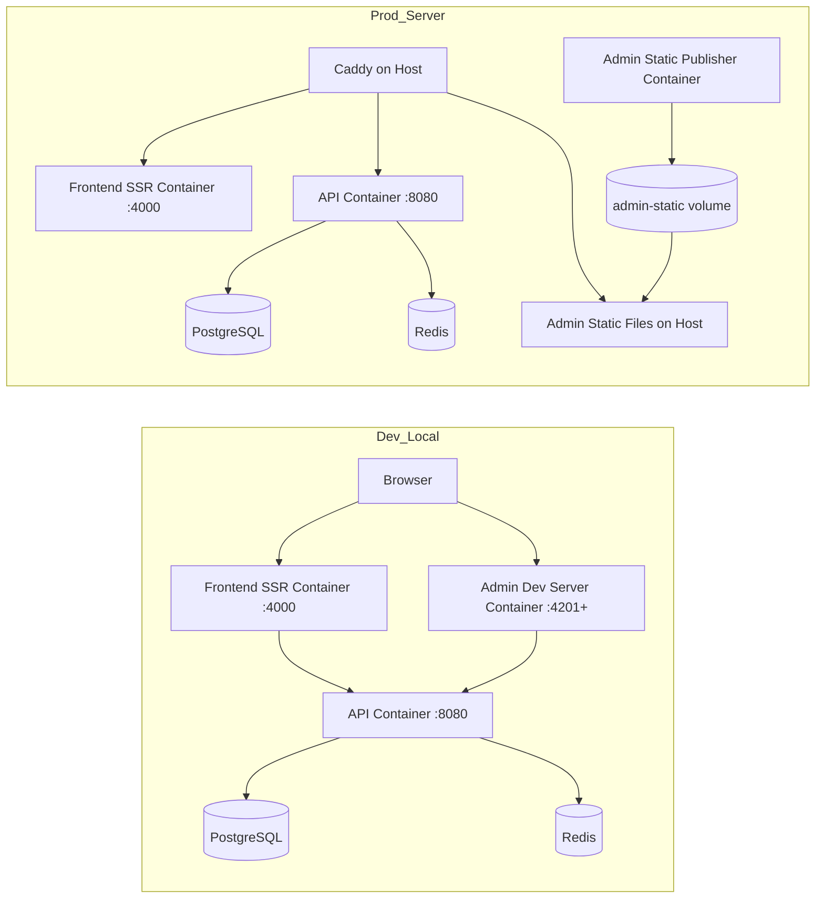

# KurdMap

Podman-first multi-service stack with a strict Dev/Prod split for Admin.

## Development URLs

- API: http://localhost:8080
- Frontend: http://localhost:4000
- Admin (dev web server): http://localhost:4201 (or next free port selected by script)
- PostgreSQL host port: 55432
- Redis host port: 56379

## Production URLs

- Frontend: https://kurdmap.de
- API: https://gs6xapi.kurdmap.eu
- Admin: https://admin.kurdmap.de

## Architecture



## Admin Dev vs Prod Behavior

- Development:
  - Admin container runs a local HTTP server (Python) on container port 8081.
  - Port is mapped to localhost using ADMIN_DEV_PORT (auto-selected by start script).
  - Healthcheck validates HTTP reachability before healthy state.

- Production:
  - Admin container does not run any web server.
  - It only publishes built static artifacts to admin-static volume.
  - Host Caddy serves Admin files externally.

## Startup

### Recommended Dev Startup (auto Admin port selection)

```bash
cd docker
./start-dev.sh
```

The script:

- checks Admin dev port conflicts
- selects a free port (4201, 4202, ...)
- starts/rebuilds stack
- prints active Dev URLs

### Manual Startup

```bash
cd docker
podman compose up -d --build
podman compose ps
```

## Independent Admin Service Operations

```bash
cd docker
make admin-start
make admin-stop
make admin-rebuild
make admin-test
```

## Build / Run / Update / Logs

```bash
cd docker
make build
make build-no-cache
make run
make restart
make down
make logs
make logs-api
make logs-frontend
make logs-admin
```

## Backup and Recovery

```bash
cd docker
make backup
make restore FILE=../backups/<backup>.sql.gz
```

## Validation Commands

```bash
cd docker

# Service status
podman compose ps

# Endpoints
curl -fsS http://localhost:8080/health
curl -fsI http://localhost:4000/
curl -fsI http://localhost:${ADMIN_DEV_PORT:-4201}/login || curl -fsI http://localhost:${ADMIN_DEV_PORT:-4201}/

# Admin -> API connectivity from inside admin container
podman exec kurdmap-admin wget -qO- http://api:8080/health

# Health and logs
make health
podman logs kurdmap-api --tail=100
podman logs kurdmap-admin --tail=100

# Restart cycle
make restart
make health
```

## Troubleshooting

### Port conflicts

- Use ./start-dev.sh so Admin port is auto-selected.
- For custom ports, set ADMIN_DEV_PORT before startup.

### Created/stuck containers after interrupted compose

```bash
cd docker
podman compose down --remove-orphans
podman compose up -d
```

### Disk pressure

```bash
podman image prune -af
podman container prune -f
podman volume prune -f
```

### Redis warning: memory overcommit

On host:

```bash
sudo sysctl -w vm.overcommit_memory=1
echo 'vm.overcommit_memory=1' | sudo tee /etc/sysctl.d/99-kurdmap.conf
```

### Locale warnings in terminal

Set valid locale on host shell profile (LANG/LC_*).
